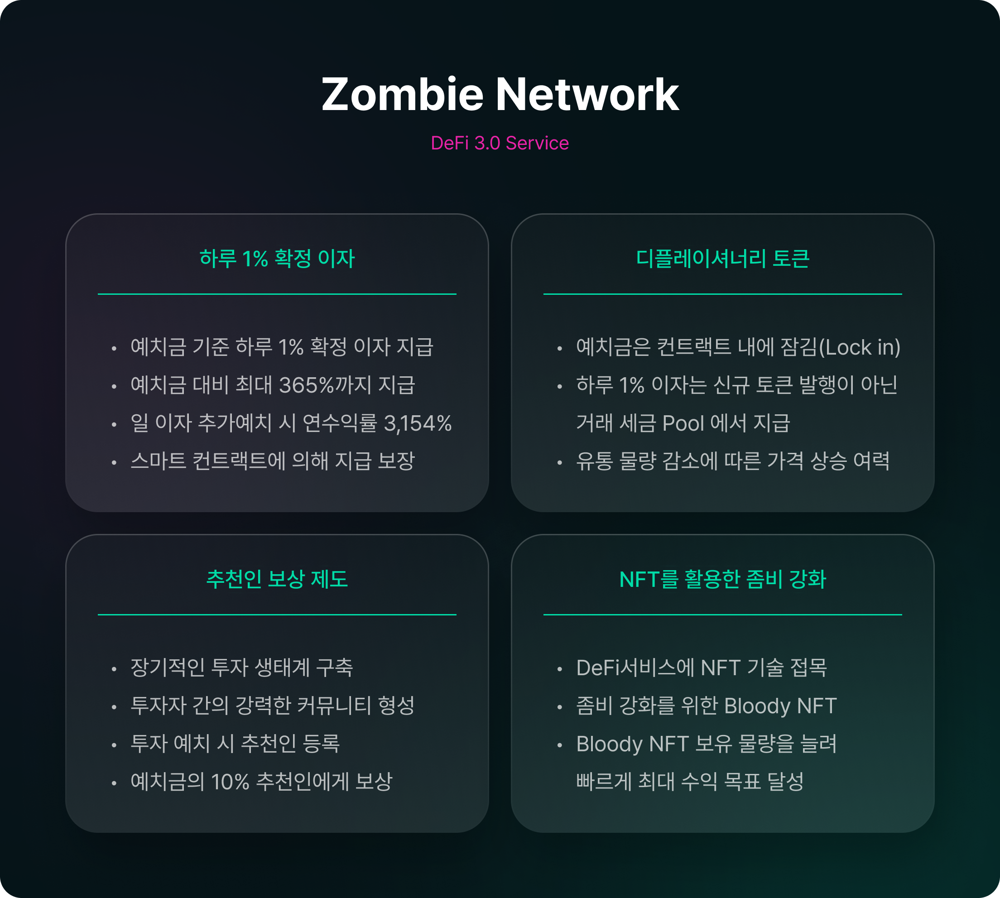

# 좀비 네트워크 개요

## 좀비 네트워크 서비스 소개&#x20;

> **좀비 네트워크 서비스는 하루 1%의 확정 이자를 제공하는 클레이튼 기반의 신개념 DeFi 3.0 프로젝트로 공식 토큰 이름은 $BLD(BLOOD 토큰) 입니다.**

> **좀비 네트워크 참여자는 하루 1% 이자 수익을 받으며, 투자 원금 대비 최대 365%까지 수익을 얻을 수 있습니다. 매일 발생하는 이자 수익을 수시로 인출할 수도 있지만 이 금액을 재예치 함으로써 높은 복리 수익을 얻을 수 있습니다. 더불어  추천인 보상 제도를 활용하여 누적 수익을 빠르게 늘려갈 수 있습니다.**

> **BLOOD 토큰의 구매, 예치, 재예치, 인출, 판매, 전송 등 모든 거래에는 5 % \~ 10%의 세금이 부과되고, 이 세금은 모두 Tax Pool에 쌓이게 됩니다. 참여자에게 지급되는 이자 및 보상금은 이 Tax Pool 에 쌓인 자금에서 지급됩니다.**

> **좀비 네트워크는 BLD-KLAY 유동성 풀을 운영합니다. KLAY 단일 코인을 활용하여 BLD-KLAY 풀에 유동성을 제공할 수 있으며, 보상금으로 KLAY 코인을 지급 받습니다.**


**DeFi 3.0:** DeFi 2.0은 올림푸스DAO로 대표되는 서비스로 현재까지 100여 개 이상의 유사 서비스가 런칭 되었습니다. 초기 DeFi 서비스는 유동성 공급을 투자자들에게만 의존하다 보니 시장 상황에 따라 투자자들이 유동성을 해제하고 떠나게 될 경우 생태계가 급격히 무너지는 문제점이 발생했습니다.&#x20;

DeFi 2.0은 이를 해결하기 위해 프로토콜이 유동성을 직접 공급하는 방식을 도입했고 , 신규 투자자가 구매하는 토큰 가격의 프리미엄을 기존 스테이킹 투자자들에게 분배함으로써 고수익을 제공하려 했습니다.&#x20;

그러나 DeFi 2.0 투자자들 역시 시장 상황에 따라 수시로 스테이킹을 해제하며 서비스를 이탈하는 사례가 발생하고, 신규 투자자 유입이 감소함으로써 수익률이 급격히 무너지는 문제가 발생하고 있습니다.&#x20;

DeFi 3.0은 프토토콜 자체 유동성 공급이라는 DeFi 2.0의 장점은 유지함과 동시에 **Tax System**을 활용하여 투자자들에게 **확정적 수익률**을 스마트 컨트랙트 기반으로 보장하고, 토큰 유통량을 감소시키는 **디플레이셔너리 토큰**을 기반으로 토큰 가격을 안정화하는 신개념 DeFi 서비스 입니다.  좀비 네트워크 서비스는 클레이튼 체인 최초로 개발된 DeFi 3.0 서비스입니다.


## 좀비 네트워크 스토리


거대한 자연 재해 이후, 바이러스로 인해 지구의 모든 생명체들은 좀비가 되었다.

좀비 생활이 익숙해질 때쯤 좀비가 되기 전으로 돌아갈 수 있는 방법을 찾았다는 소문이 들려왔다.

좀비 네트워크라는 지역에 있는 샘에서 나오는 블러드를 모으면 몸이 점점 회복되고 결국에는 좀비에서 벗어날 수 있다는 것이다.

소문을 들은 좀비들은 좀비 네트워크를 향해 저마다 무리를 만들어 떠났고 블러드가 나오는 샘을 찾았다.

샘에서는 블러드가 하루에 한 방울씩 흘러나왔기에 샘을 차지하기 위해 싸움을 벌였다.

쉽게 죽지 않는 탓에 낮이나 밤이나 서로를 물어 뜯는 광경은 참혹했다.

많은 좀비들이 좀비 네트워크로 모였고 샘을 차지하기 위해 싸우던 도중 주변에서 여러 개의 샘들이 생겨났다.

좀비 네트워크에 좀비가 많아질수록 샘들도 많아졌다. 좀비들은 싸움을 멈추고 상황을 파악했다.

“싸우지 않아도 블러드를 모을 수 있어. 많은 좀비들을 데려오면 돼!”

“우리 힘을 합쳐 샘을 만들어 냅시다!”

외침과 함께 좀비들은 더 많은 좀비들을 데려오기 위해 움직이기 시작했다.

더 많은 좀비와 더 많은 블러드로 좀비에서 벗어나기 위해...


우리는 DeFi 세상에 입문한 이래 무성한 소문에 이끌려 여기 저기 다양한 DeFi 프로젝트를 기웃거리면서 때론 수익을 얻는 경우도 있었지만 대부분 손실을 면치 못하고 있습니다. 자금력과 정보력을 앞세운 고래들의 횡포에 좌절해야 했던 순간도 많았고, 고수익을 보장한 곳도 결국에는 토큰 가격의 하락에 맥을 못추는 상황이 일상이 되었습니다. 공들여 투자했던 토큰이 어느 새 아무도 거래하지 않는 좀비 토큰이 되어 있고, 투자자인 우리도 이러지도 저러지도 못하는 어쩌면 좀비와도 같은 투자 상황이 되어 버렸습니다.&#x20;

이러한 우리들을 위해 좀비 네트워크가 탄생했습니다.&#x20;

좀비 네트워크는 시간이 지나도 변함없이 확정적인 이자율을 보장하고 그러면서도 오히려 토큰 유통량은 감소하여 토큰 가격 상승여력이 더 높은 곳입니다. 고래들이 쉽사리 횡포를 부릴 수 없는 다양한 장치를 갖추고 있고, 장기적인 재투자를 통해 수익을 극대화 할 수 있는 곳입니다.&#x20;

좀비는 사람의 피를 마시며 생존한다고 합니다. 그러나 좀비 네트워크에서 제공하는 특별한 피(BLOOD 토큰)는 좀비를 사람으로 변화시켜 줄 수 있습니다.&#x20;

좀비 네트워크에 머물면서 충분한 양의 BLOOD 토큰을 모으시기 바랍니다. 좀비 네트워크의 BLOOD 토큰은 혼자서 모아가는 것보다는 주변의 좀비 친구들과 함께 팀을 이루면 훨씬 더 빠르게 모아갈 수 있습니다. 좀비 네트워크를 통해 우리 모두 좀비와 같은 투자 행태에서 벗어나 경제적 자유를 누릴 수 있기를 희망합니다.
