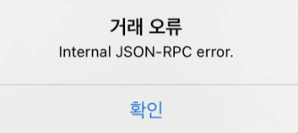
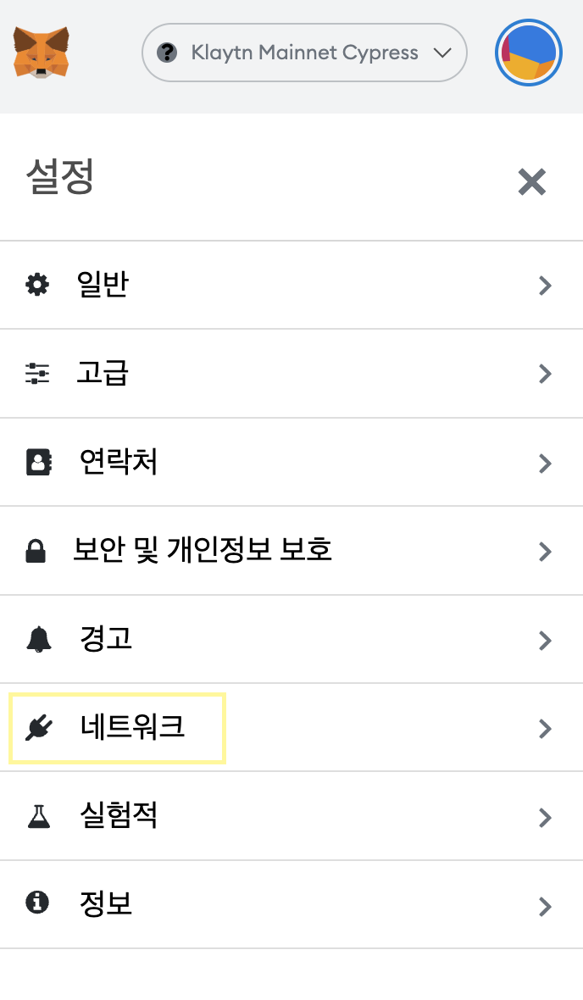
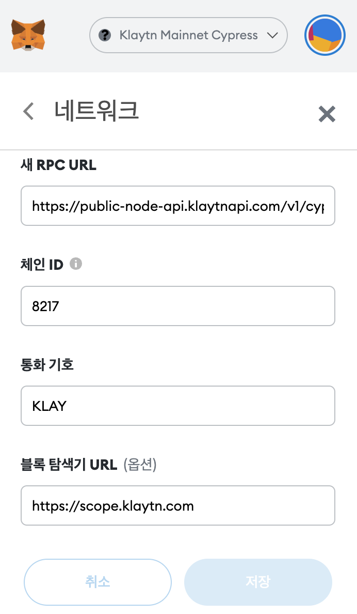

# 지갑 이용 가이드

### MetaMask에 클레이튼 네트워크 추가하기

[https://medium.com/klaytn-kr/%ED%81%B4%EB%A0%88%EC%9D%B4%ED%8A%BC%EC%97%90-%EB%A9%94%ED%83%80%EB%A7%88%EC%8A%A4%ED%81%AC-%EC%B6%94%EA%B0%80%ED%95%98%EA%B8%B0-884cb384ed81](https://medium.com/klaytn-kr/%ED%81%B4%EB%A0%88%EC%9D%B4%ED%8A%BC%EC%97%90-%EB%A9%94%ED%83%80%EB%A7%88%EC%8A%A4%ED%81%AC-%EC%B6%94%EA%B0%80%ED%95%98%EA%B8%B0-884cb384ed81)\
\
<mark style="color:red;">\*</mark>유의 사항 : 다음과 같은 오류가 발생한다면 네트워크 설정을 확인해보세요.\

1. 메타마스크 설정에서 네트워크를 클릭해주세요.&#x20;

2\. Klaytn Mainnet Cypress 에서 네트워크 설정을 아래 사진과 같이 변경 후 저장해주세요&#x20;

새 RPC URL : https://public-node-api.klaytnapi.com/v1/cypress

체인 ID : 8217

통화 기호 : KLAY

블록 탐색기 URL : https://scope.klaytn.com

\*위 설정으로 변경한 후에도 같은 문제가 지속적으로 나타난다면 관리자에게 문의 부탁드립니다.

### KaiKas 설치 및 사용법

[ https://klaytn-tech.medium.com/groundx%EC%9D%98-%EC%9B%94%EB%A0%9B-1-kaikas-6185191cbab2](https://klaytn-tech.medium.com/groundx%EC%9D%98-%EC%9B%94%EB%A0%9B-1-kaikas-6185191cbab2)
