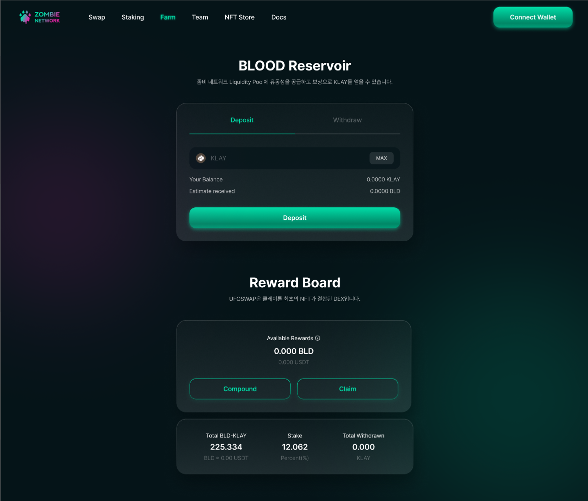
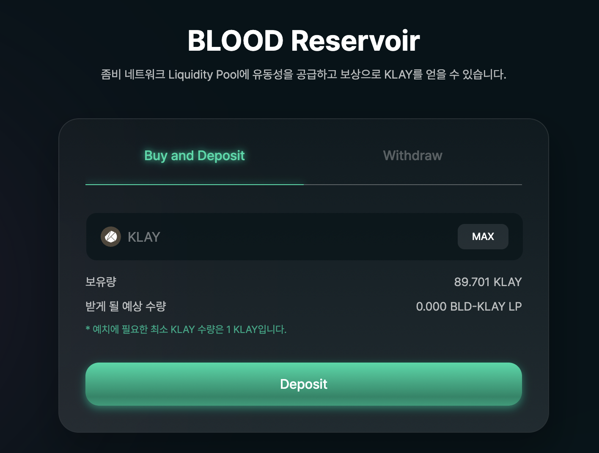
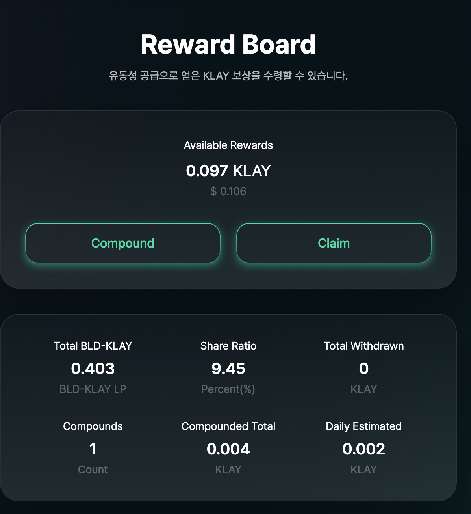
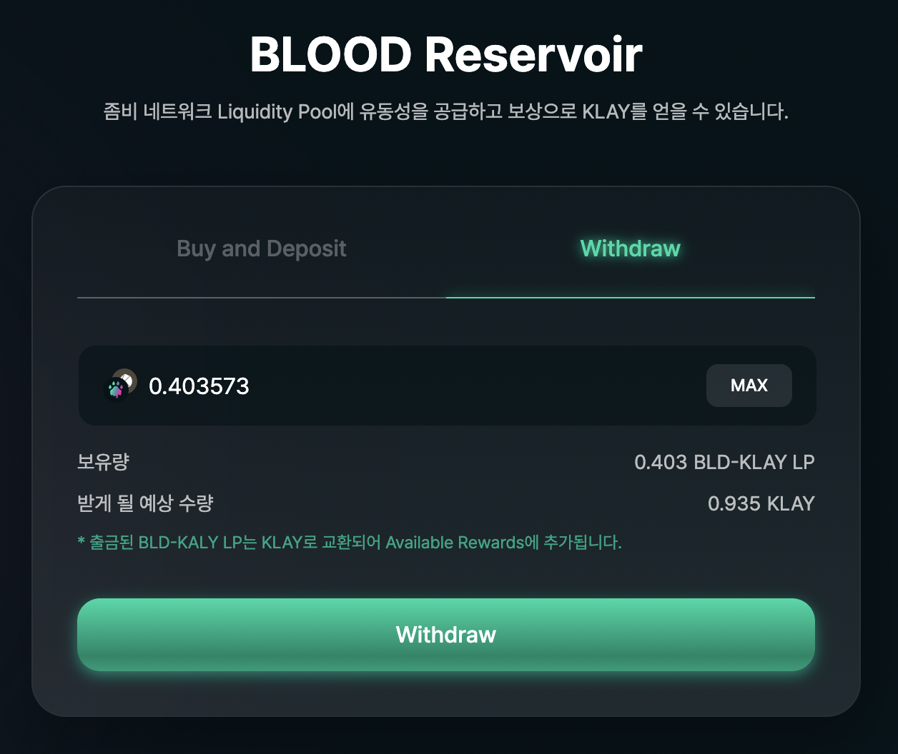
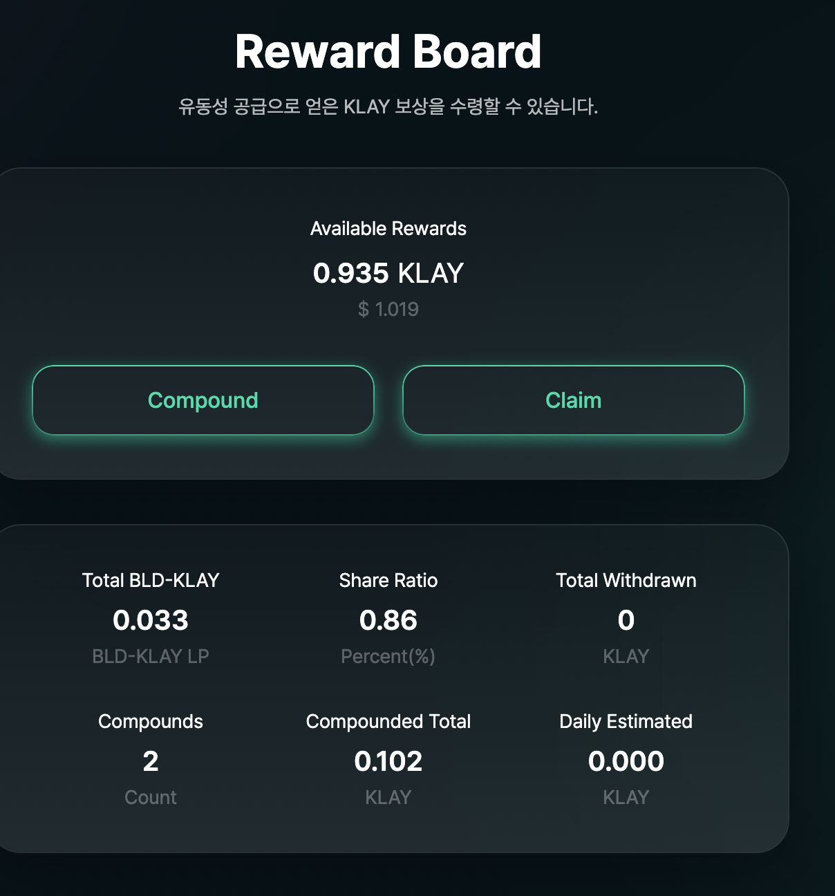
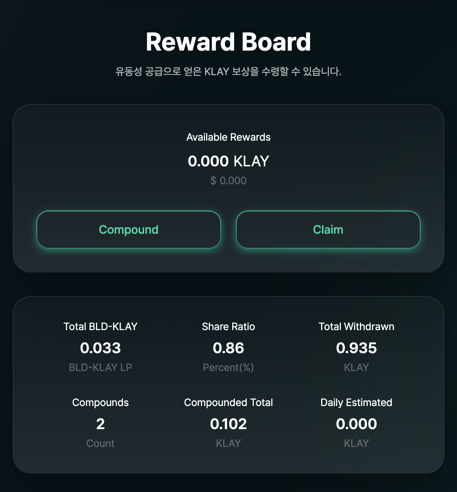
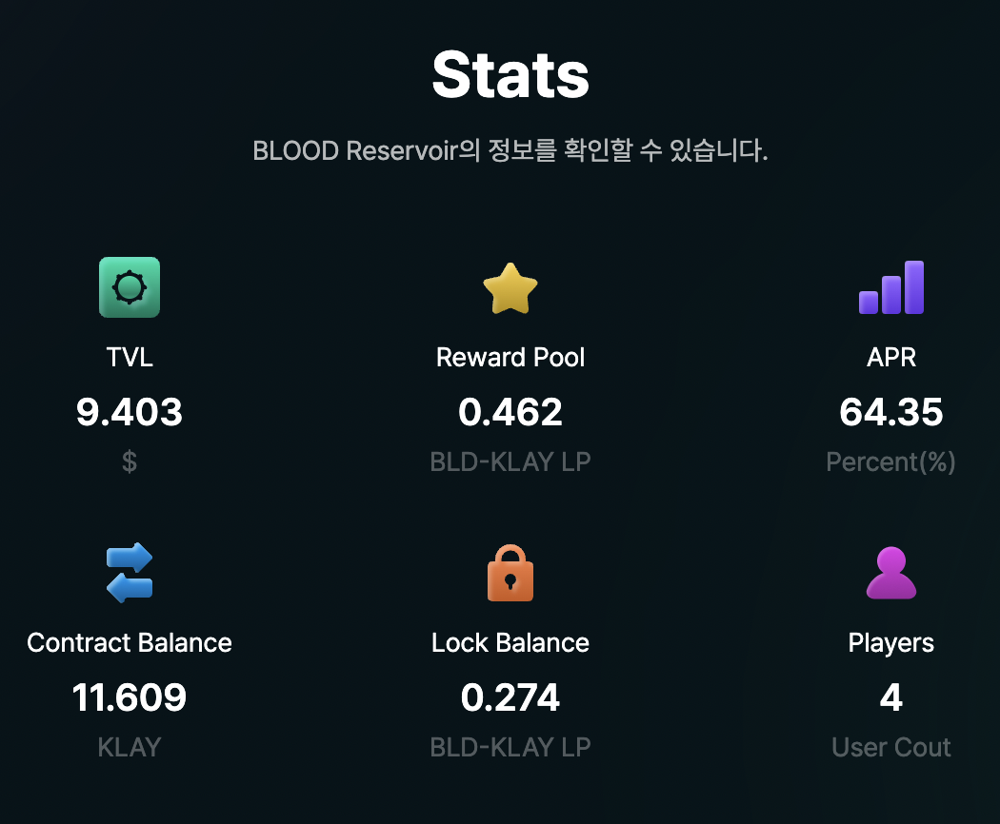

# Farm

### **Buy & Deposit: BLD-KLAY 유동성 공급 기능**

BLOOD-KLAY 유동성 풀에 대한 유동성 공급은 KLAY 코인을 예치함으로써 BLD-KLAY 페어를 구성하는 형태로 이루어집니다. 현재 지갑에 보유하고 있는 KLAY 수량 중에서 유동성 공급에 예치할 KLAY 수량을 입력하면, 하단에 BLD-KLAY LP 토큰 예상 수량이 표시됩니다. 구매를 실행하시려면 Deposit(예치) 버튼을 클릭하시면 됩니다.

유동성 공급 시 10%의 거래세(Transaction Tax)가 부과됩니다. BLD-KLAY LP 토큰을 구매하는 데 사용된 KLAY의 2%는 즉시 유동성 공급자들에게 유동성 공급 비율대로 분배하여 지급됩니다. 5%는 Farm 계약 배당금 풀로 이동하는데, Farm 계약 배당금풀에 쌓인 전체 금액 중 2%를 매일 유동성 공급자들에 분배하여 지급합니다. 나머지 3%는 BLD-KLAY 유동성풀에 잠기게(Lock in) 됩니다.

유동성 공급을 통해 얻는 수익은 배당금 풀을 통한 Rewards 이외에도 Swap 메뉴에서 거래가 일어나는 경우 Swap fee (토큰 교환 수수료) 1%가 별도 부과 되는데 이 금액 역시 유동성 공급자들에게 에치 지분율에 따라 지급 됩니다.

### Withdraw: BLD-KLAY 유동성 공급 해제 기능

BLD-KLAY LP 토큰 형태로 유동성을 공급하고 있다가 이를 해제하고 KLAY로 돌려받을 수 있는 기능입니다. 유동성을 해제하고 싶은 BLD-KLAY LP 토큰 수량을 입력한 후 Withdraw(해제) 버튼을 누르시면 됩니다. 유동성 공급 해제 시에도 10%의 거래세가 부과되어 차감된 후 BLD-KLAY LP 토큰으로 반환됩니다.  이때 반환된 LP는 지갑으로 들어오는 것이 아닌 Available rewards 값으로 이동하여 기존 LP 수량 합산됩니다. 이를 지갑으로 출금하기 위해서는 Claim 요청을 보내야합니다.&#x20;

### Compound

Rewards로 얻은 KLAY 코인을 인출하지 않고 BLD-KLAY 풀에 유동성을 추가로 제공할 수 있는 기능입니다. 재예치 시 해당 KLAY 수량에 상응하는 BLD-KLAY LP 토큰이 Total BLD-KLAY 수량에 더해져 표시됩니다.

### Claim

Rewards(유동성 풀 제공 보상금)으로 얻은 KLAY를 지갑으로 인출하는 기능입니다.

### Data


**Available Rewards:** BLD-KLAY 유동성을 제공한 대가로 받은 KLAY 코인 수량 중 Compound(재예치, 유동성 추가 제공) 또는 Claim (인출) 등의 처리를 하지 않은 수량 입니다. BLD-KLAY 유동성 보상금은 배당금 풀에서 유동성 공급자의 예치 지분율에 따라 지급됩니다. 유동성 배당금 풀은 유동성 공급 및 해제 시 부과되는 거래세(Transaction Tax)를 통해 구성됩니다.

**Total BLD-KLAY:** 참여자가 KLAY 토큰으로 BLOOD 토큰을 구매하여 BLD-KLAY 풀 유동성 제공 시, BLD-KLAY LP 토큰이 생성되어 지급됩니다. 참여자가 보유하고 있는 전체 BLD-KLAY LP 토큰 수량이 표시됩니다. Rewards에 남아 있는 KLAY 수량을 Compound 할 경우 해당 KLAY 수량에 상응하는 BLD-KLAY LP 토큰 수량이 추가 됩니다.

**Stake:** BLD-KLAY LP 토큰 전체 수량 대비 참여자가 보유한 수량 비율입니다. Rewards(유동성 풀 제공 보상금) 발생 시 BLD-KLAY LP 토큰 보유자들에게 이 보유 비율을 기준으로 분배됩니다.

**Total Withdrawn:** 유동성 풀 해제로 돌려받은 KLAY 누적 수량입니다.

**Compounds:** Rewards를 재예치한 누적 횟수입니다.

**Compounded Total:** Rewards를 재예치한 KLAY 누적 수량입니다.

**Daily Estimated :** Farm 보상금 풀에서 매일 발생하는 예상 이자 KLAY수량입니다.


### 이용 방법

1. Zombienetwork 유동성을 공급하여 보상 이자를 얻을 수 있는 Blood Reservoir 페이지에 대한 설명입니다.

2\. 입력칸에 보유하고 있는 KLAY 수량 중 유동성공급하고자 하는 KLAY 수량을 입력하신 뒤 Deposit 버튼을 클릭합니다. \
Reservoir도 마찬가지로 Buy / Sell 할때 10%의 세금이 발생하며 각각의 세금은 모두 유동성 공급자들을 위한 보상과 소각으로 이동합니다.

* 받게 될 예상 수량 : 현재 Swap 페이지에 존재하는 유동성량의 비율을 고려하여 측정된 예상 수량입니다.(세금이 적용된 수량입니다)

3\. 트랜잭션을 승인하신 후 Deposit이 완료되면 아래 Reward Board에 구매후 예치한 정보가 표시됩니다.

* Available Rewards : 수령가능한 보상 KLAY를 의미합니다.
* Total BLD-KLAY : 구매 후 예치되어 있는 누적 BLD-KLAY LP 수량입니다.
* Share Ratio : 현재 Blood Reservoir을 통해 공급된 전체 LP 양 중 자신의 BLD-KLAY LP양의 비율을 나타내며 지분율을 의미합니다.
* Total Withdrawn : 예치된 LP를 예치해제 후 인출한 수량을 의미합니다.
* Compounds : 재예치한 횟수를 의미합니다.
* Compounded Total : 재예치한 누적 금액을 의미합니다.
* Daily Estimated : Farm 보상금 풀에서 매일 발생하는 예상 이자 KLAY수량입니다.

4\. Compound 버튼을 누르면 Available Rewards에 있는 KLAY 수량이 재예치 됩니다.

5\. Claim 버튼을 누르면 Available Rewards에 존재하는 KLAY수량이 지갑으로 이동합니다.

6\. Withdraw 탭으로 이동하여 예치중인 BLD-KLAY LP 수량 중 원하는 수량을 입력한 뒤 Withdraw 버튼을 클릭하여 트랜잭션을 실행합니다.

7\. Withdraw가 완료되면 해당 LP만큼에 해당하는 KLAY 수량이 Available Reward 영역에 추가됩니다.

8\. 해당금액을 지갑으로 보내기 위해서는 위의 방법과 마찬가지로 Claim 버튼을 클릭하여 트랜잭션을 실행합니다. 트랜잭션이 완료되면 Total Withdrawn에 해당 금액만큼이 추가됩니다.

9\. Stats 영역에서는 Blood Reservoir 컨트랙트에 존재하는 정보들을 확인할 수 있습니다.

* TVL : 세금을 제외하고 Reservoir를 통해 공급한 유동성 공급량의 KLAY 가치를 의미합니다.
* Reward Pool : 유동성공급자들에게 매일 2%의 보상을 지급해주는 보상풀을 의미합니다.
* APR : 보상풀에서 발생하는 매일 2%의 보상이자를 1년 단리로 계산한 수치입니다.
* Contract balance : Reservoir을 통해 공급된 유동성의 총 KLAY 수량을 의미합니다.
* Lock Balance : 유동성 공급시 발생하는 3%의 세금이 쌓이는 공간이며 해당 물량은 소각됩니다.
* Players : 유동성공급에 참여한 참여자들 수입니다.

