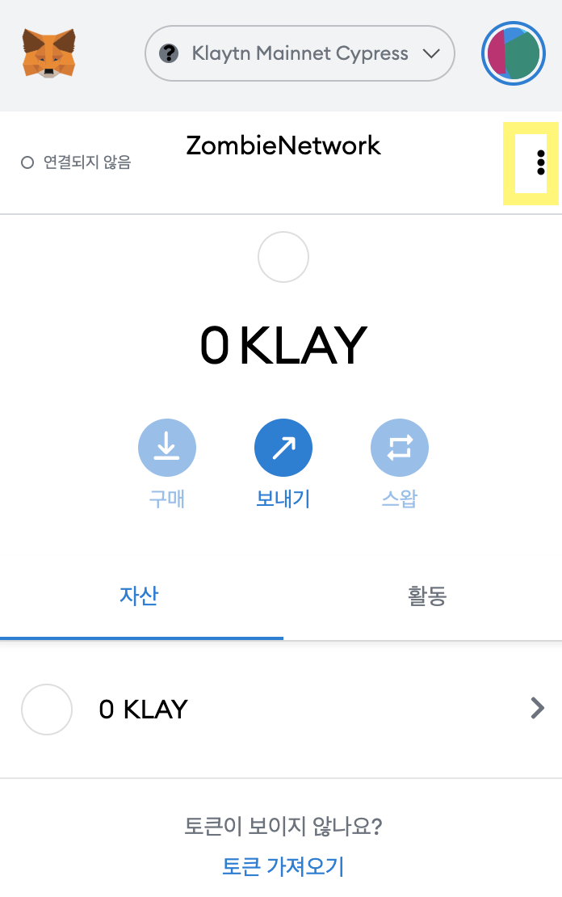
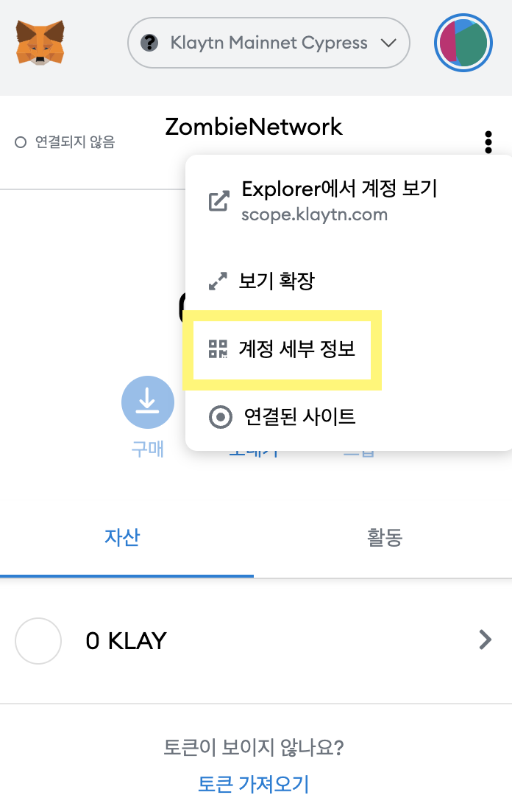
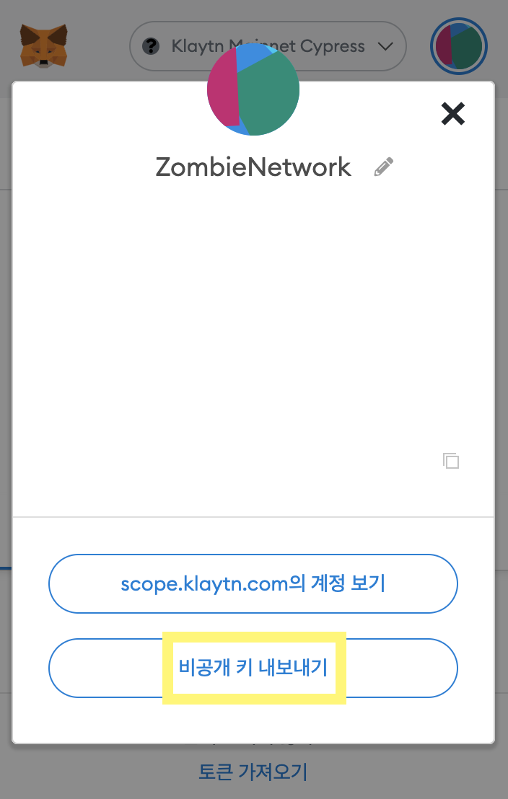
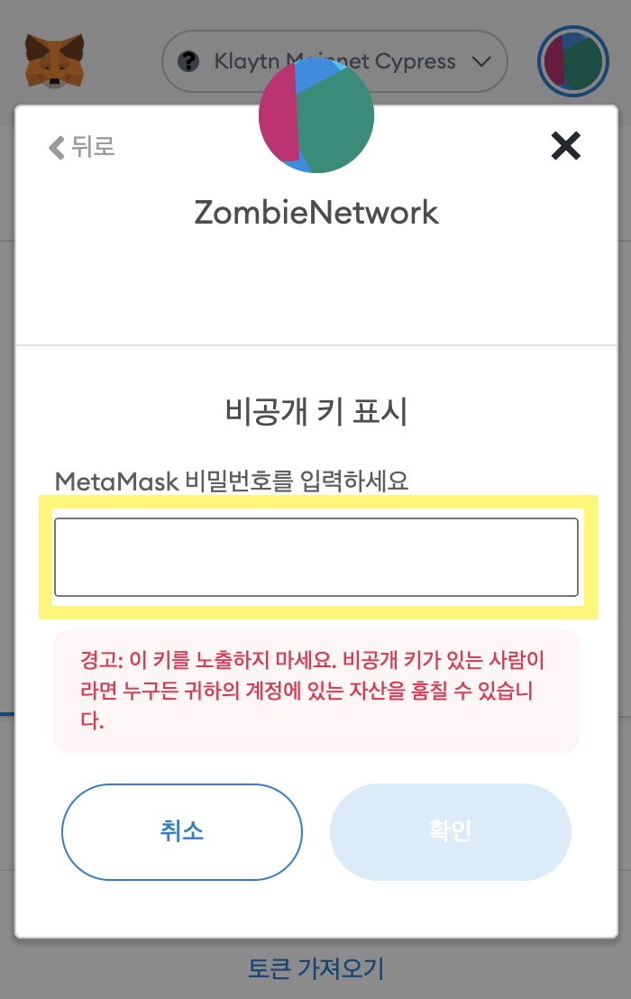
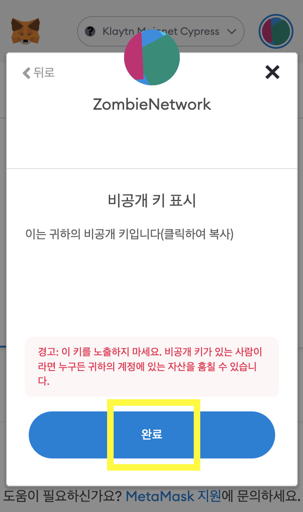
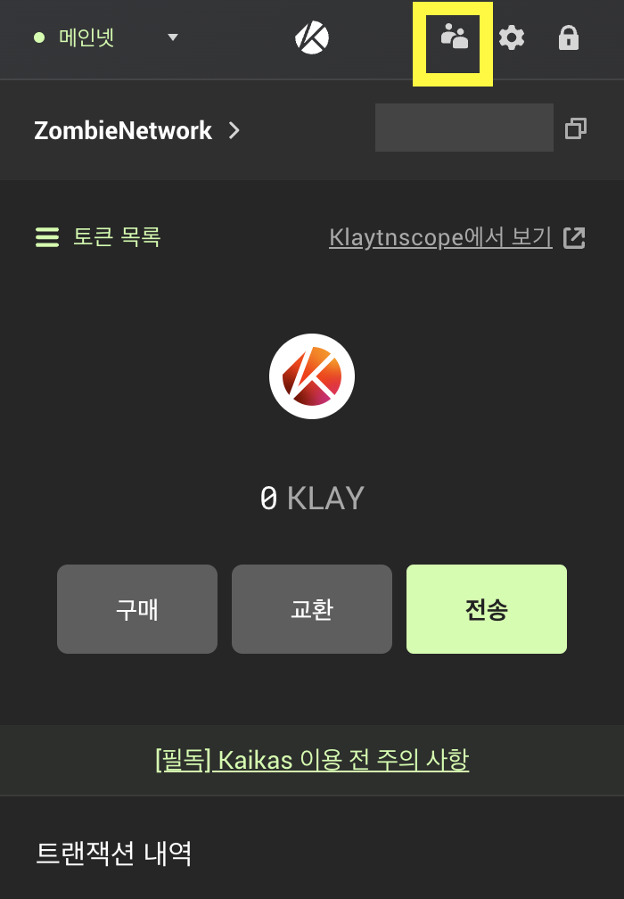
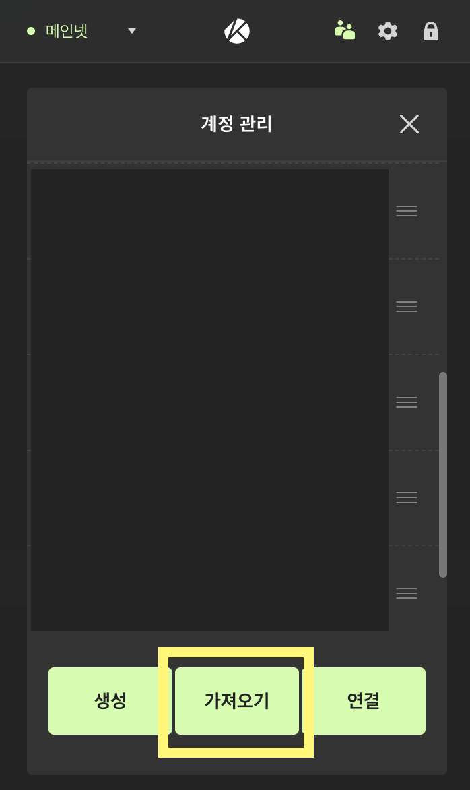
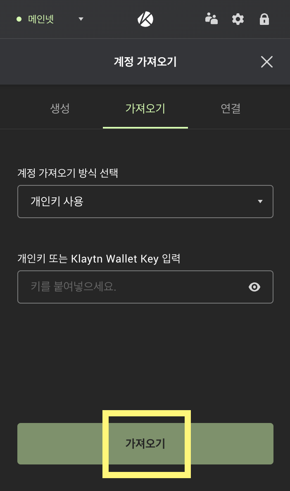
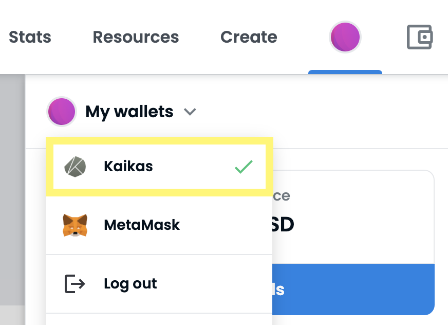

# Opensea 이용 가이드

오픈씨에서는 아직 클레이튼 기반 NFT에 대해서는 카이카스 지갑만 지원하고 있기 때문에&#x20;

카이카스 지갑에 메타마스크 계정 생성하는 방법을 이용해야 합니다.

1. 메타마스크 우측 상단의 점 3개를 클릭합니다.

2\. 계정 세부 정보를 클릭합니다.&#x20;

3\. 비공개 키 내보내기를 클릭합니다.

4\. 메타마스크 암호를 입력한 뒤 확인을 클릭합니다.

5\. 비공개 키를 복사하고 완료 버튼을 클릭합니다.

6\. 카이카스 지갑에서 우측 상단의 사람 아이콘을 클릭합니다.

7\. 가져오기를 클릭합니다.

8\. 복사한 메타마스크 비공개 키를 입력한 뒤 가져오기를 클릭하면 카이카스 지갑에 메타마스크 계정이 생성됩니다.

9\. 메타마스크 지갑이 카이카스에 추가 되었다면, 오픈씨에 들어가 카이카스 지갑으로 연결합니다. 카이카스 지갑으로 연결하면 메타마스크에 있는 NFT정보들이 똑같이 표기되며 구매 및 판매가 가능합니다.

