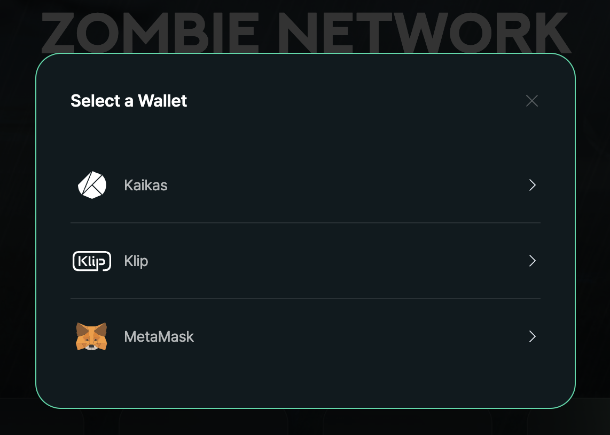
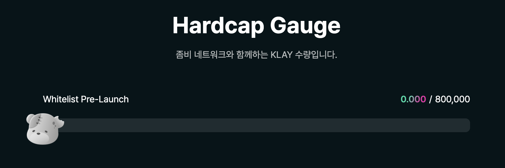
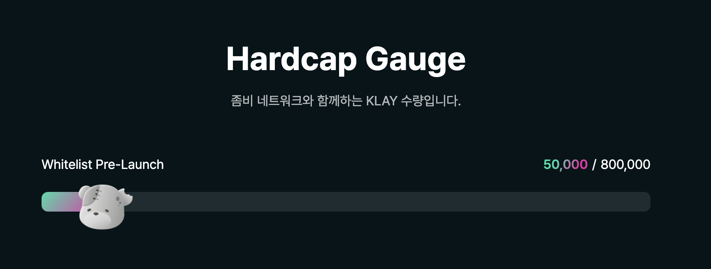
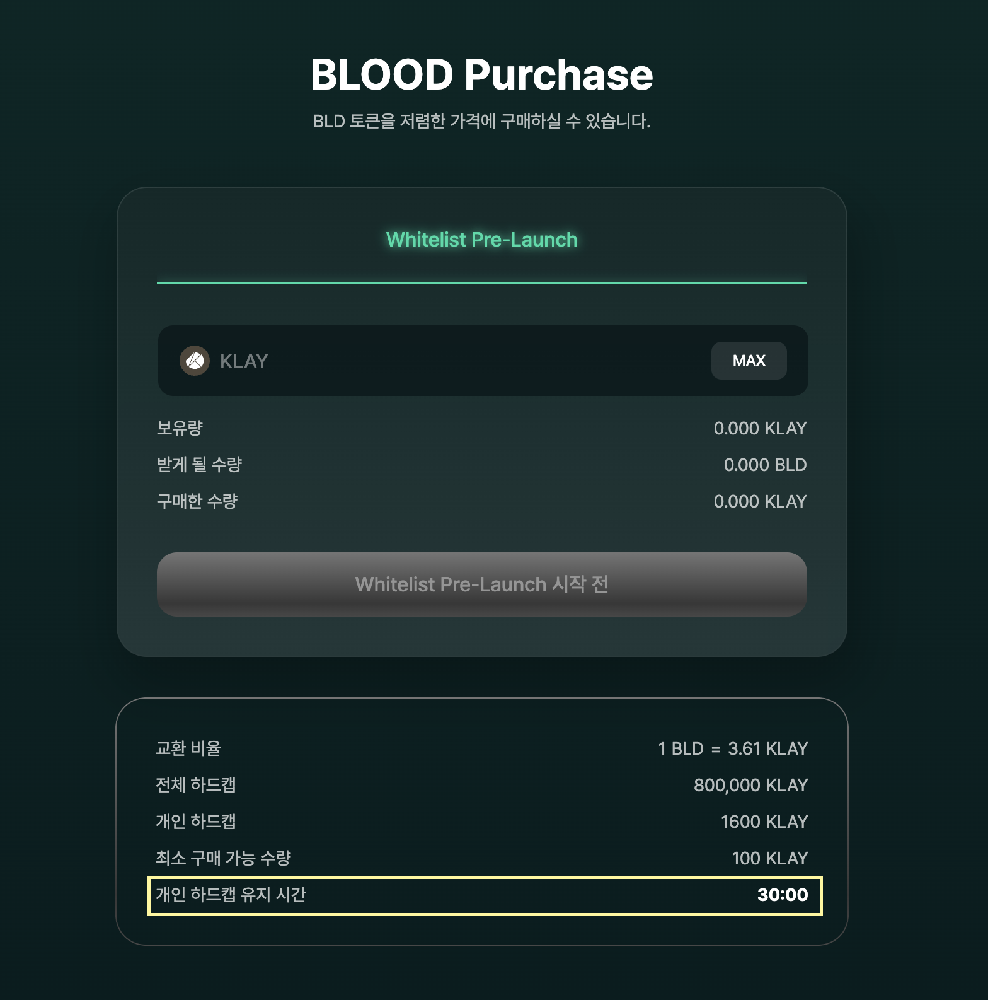
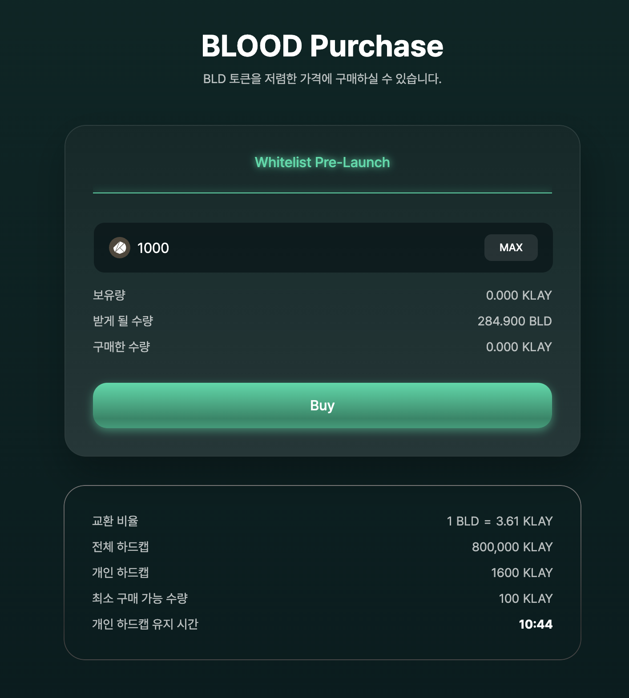
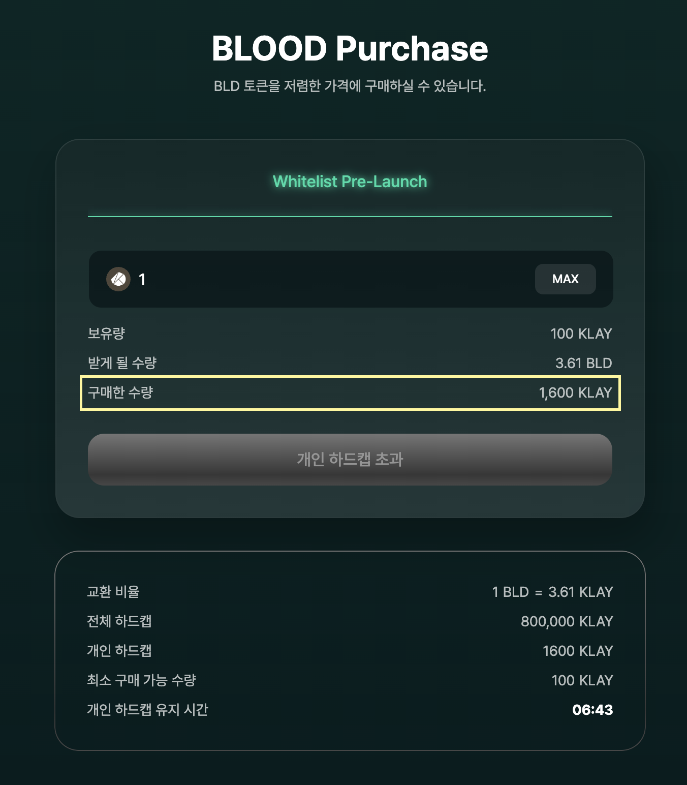
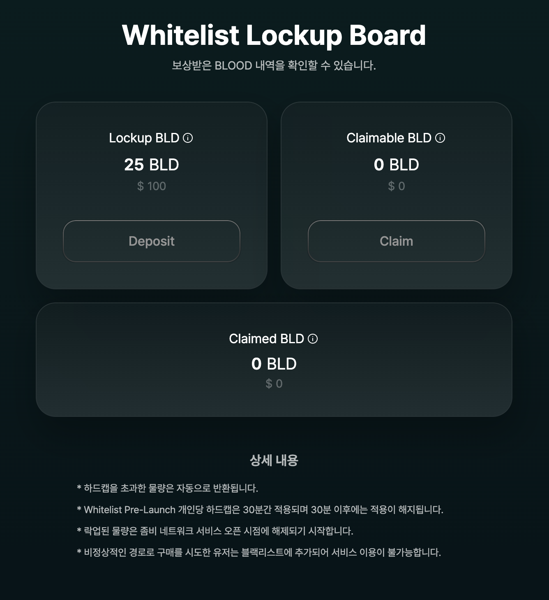

# Pre-launch 가이드

이 문서는 Zombie Network의 화이트리스트 Pre-launch를 이용하는 가이드 안내서입니다.

화이트리스트 Pre-launch는 화이트리스트로 선정된 주소를 소유한 분들만 참여 가능합니다.

3월 24일 목요일 오후 8시 오픈 예정이며 Pre-launch가 시작되고 30분 동안은 개인당 Hard cap이 적용됩니다. 30분이 지난 이후부터는 개인당 Hard cap 제한이 사라지고 총 Hard cap (800,000) 범위 내에서 잔여 수량에 한하여 구매할 수 있도록 진행됩니다.

개인당 Hard cap은 100 \~ 1,600 KLAY입니다.

1\. Zombie Network 홈페이지에 접속하여 오른쪽 상단의 Connect Wallet을 클릭합니다. 화면 중앙에는 Pre-launch 오픈까지 남은 시간이 표기됩니다.

2\. 원하는 지갑을 선택합니다. PC는 KaiKas, Klip, MetaMask 지갑을 지원하며 모바일로 접속 시에는 Dcent, MetaMask지갑을 지원합니다.&#x20;

3\. 전체 하드캡에 대한 게이지가 표시됩니다. 게이지를 통해 화이트리스트 Pre-launch 총 하드캡의 남은 물량을 확인할 수 있습니다. &#x20;

4\. 아래 화면에서 KLAY를 입력하여 BLOOD 토큰을 구매하실 수 있습니다. 화이트리스트 Pre-launch가 시작되면 구매 버튼이 활성화됩니다. 개인 하드캡 유지시간은 구매창 아래 화면에서 확인하실 수 있습니다.&#x20;

5\. 화이트리스트 Pre-launch가 시작되면 아래 화면과 같이 BLOOD 토큰 구매가 가능해집니다. 정해진 Hard cap 이상의 KLAY를 입력하여 구매를 진행하실 경우 구매가능한 수량은 정상적으로 구매가 진행되고 초과된 KLAY는 해당 지갑으로 반환됩니다.&#x20;

6\. 개인 하드캡을 초과하면 개인 하드캡 유지 시간이 종료될 때까지 구매버튼이 비활성화됩니다. 화이트 Pre-launch에서 구매 완료한 KLAY 수량은 아래 화면에서 확인하실 수 있습니다.&#x20;

7\. 구매한 BLOOD 토큰은 아래 화면에서 락업되어 있는 것을 확인하실 수 있습니다. 본 서비스 오픈 이후 전체 물량을 Deposit하거나 90일간의 선형 분배를 통해 Claim 가능하게 된 BLOOD 토큰을 Claim 하실 수 있습니다.

Deposit : 락업된 물량을 락업기간 동안 기다리지 않고 전체 락업 물량 예치 가능한 버튼

Claim : 락업된 물량에서 Claim 가능하게 된 BLOOD 토큰을 Claim하여 개인지갑으로 이동시키는 버튼&#x20;

**모든 참여자분들은 상세 내용을 사전에 반드시 숙지하시고 참여해주시기 바랍니다.**

**\*주의 : Pre-launch 참여시 비정상적인 경로나 봇으로 의심되는 트랜잭션으로 구매를 한 경우에 해당 지갑 주소는 모두 블랙리스트 처리되며, 블랙리스트 처리된 지갑의 모든 트랜잭션에는 100%의 세율로 세금을 부과할 예정이니 이점 유의하시기 바랍니다.**
