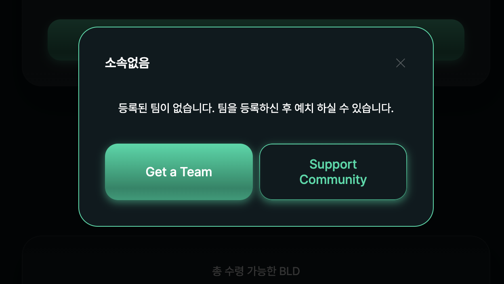

# Staking

.PNG>)

### Deposit: BLOOD 토큰 Staking (단일 예치) 기능

지갑에 보유하고 있는 BLOOD 토큰을 좀비 네트워크에 예치할 수 있는 기능입니다. 예치하고자 하는 수량을 입력하신 후 Deposit(예치) 버튼을 클릭하시면 됩니다. Deposit(예치) 기능 수행 시 예치하고자 하는 수량의 10%는 세금이 부과되어 차감되며, 90%의 수량만큼만 예치되게 됩니다[(\[참고\] 좀비 네트워크 특징 > Tax 시스템)](../features/tax.md). BLOOD 토큰을 예치하는 즉시 하루 1% 이자 지급이 개시됩니다.

### Compound: Available Rewards에 대한 재예치 기능

Available Rewards(처분 가능 이자 수량)을 재예치하여 예치금(Deposits) 총량을 늘리고 복리 이자 수익을 얻을 수 있는 기능입니다. 재예치 시에는 5%의 세금이 부과되어 차감된 후 재예치 하고자 하는 Available Rewards의 95% 만큼만 예치 됩니다[(\[참고\] 좀비 네트워크 특징 > Tax 시스템)](../features/tax.md). 재예치 후 화면 상의 예치금(Deposits)은 해당 수량(5% 세금 차감 후 수량)만큼 증가하며, Max Payouts(최대 인출 가능 수량)은 예치금 수량 증가분의 365%에 해당하는 만큼 수량이 증가합니다. 동시에 누적인출수량(Claimed)은 재예치한 Available Rewards 수량(5% 세금 차감 전)만큼 증가합니다. 재예치한 금액 역시 예치금(Deposits)이기 되기 때문에 다른 예치금과 마찬가지로 인출할 수 없습니다. Available Rewards 남아 있다면 하루 중 언제든지 수시로 실행이 가능합니다.

### Claim: Available Rewards에 대한 인출 기능

Available Rewards(처분 가능 이자 수량)을 인출하는 기능입니다. 인출(Claim) 시에는 10%의 세금이 부과되어 차감된 후 인출 하고자 하는 Available Rewards의 90% 만큼만 인출되어 지갑에 전송되게 됩니다[(\[참고\] 좀비 네트워크 특징 > Tax 시스템)](../features/tax.md). 인출 후 화면 상의 예치금(Deposits)과 Max Payout(최대 인출 가능 수량)은 변화가 없으며, 누적인출수량(Claimed)은 인출한 Available Rewards 수량(10% 세금 차감 전)만큼 증가합니다. Available Rewards가 남아 있다면 하루 중 언제든지 수시로 실행이 가능합니다. 인출하여 지갑에 전송된 BLOOD 토큰은 판매(Sell)를 하여 KLAY 코인으로 교환할 수 있으며 Airdrop 전송을 할 수도 있습니다. &#x20;

### Data


**Available Rewards:** 처분 가능 이자 수량입니다. 총 예치금 (Deposits) 기준 하루에 1%의 이자가 발생하며, 실시간으로 이자가 더해져서 표시되는 BLOOD 토큰 수량입니다. 하단에 현 USDT 시세 기준으로 현재 금액 가치가 표시되어 있습니다. 오늘 하루 쌓인 이자 수량을 표시하는 것이 아니라 현재까지 발생한 이자 중 재예치(Compound)나 인출(Claim) 처리를 하지 않고 쌓여 있는 전체 수량입니다. 여기에 표시되는 수량만큼 언제든지 재예치 또는 인출을 수행하실 수 있습니다. 단, 재예치 또는 인출 시 표시된 수량 전체에 대해 수행되며, 수량을 나누어 재예치 또는 인출을 할 수는 없습니다. Whale Tax(고래세)를 적용 받는 경우 매일 발생하는 이자 수익은 Whale Tax(고래세) 만큼 차감된 후에 처분 가능 이자 (Available Rewards) 수량에 더해 집니다.

**Deposits:** 누적 예치 수량으로 현재까지 누적된 예치금 전체의 BLOOD 토큰 수량입니다. 하단에 현 USDT 시세 기준으로 현재 금액 가치가 표시되어 있습니다. 이 수량에는 참여자가 직접 예치한 수량, 재예치한 수량, Airdrop으로 받은 수량, 추천인 보상금으로 받은 수량 등이 모두 합산되어 총 BLOOD 토큰 예치금(Deposits) 수량으로 표시됩니다. 이 수량을 기준으로 하루 1%의 이자가 실시간으로 계산됩니다.

**Claimed:** 누적 인출 수량으로 서비스 참여 후 발생한 총 누적 이자 수량 중 재예치 또는 인출을 수행한 누적 BLOOD 토큰 수량입니다. 재예치 기능의 경우 처분 가능 이자(Available Rewards) 수량을 우선 인출한 후 다시 예치하는 방식으로 이루어지며 누적 인출 수량(Claimed)에 합산됩니다.

**Re-deposits:** 이자로 발생한 수익에 대해 인출하지 않고 다시 예치한 누적 BLOOD 토큰 수량입니다.

**Referral Rewards:** 추천인 보상 제도를 통해 보상 받은 BLOOD 토큰 누적 수량입니다. 추천인 보상 제도를 통해 보상을 받기 위해서는 사전에 추천인 보상용 NFT를 필요한 수량만큼 지갑에 보유하고 있어야 합니다. [(\[참고\] 추천인 보상제도)](../features/referral.md)

**Max Payout:** 최대 인출 가능 수량으로 인출 가능한 BLOOD 토큰 총 수량입니다. 현재 예치금 수량의 365%까지 인출이 가능하며 이 수량이 최대 인출 가능 수량 (Max Payout)으로 계산되어 표시됩니다. 여기서 인출이라 함은 인출 후 KLAY 토큰으로 판매한 수량뿐만 아니라 재예치 수행 중 내부적으로 거치게 되는 인출 수량도 포함합니다. 화면에 표시된 기준으로 보면 처분 가능 이자 수량(Available)과 누적 인출 수량(Claimed)의 합이 현재까지의 누적 이자 지급량이며, 이 수량은 최대 인출 가능 수량(Max Payout) 수량까지만 지급 됩니다. 그리고 Max Payout은 최대 100,000개 까지만 가능하도록 설계되어 있습니다. 예치금이 27,397개 까지 쌓이면 최대 인출 가능 수량이 이 수량의 365% 해당하는 99,999개가 되고, 여기서 예치금을 더 늘리더라도 최대 인출 가능 수량 제한 100,000개를 넘어가기 때문에 그 이상으로 더 늘어나지는 않습니다.

**Team:** 추천인 보상 제도 기준으로 하위라인으로 구성된 팀원의 수를 표시합니다. 첫번째 숫자는 해당 투자자를 추천인으로 등록한 1차 하위라인 팀원 수이고, 두번째 숫자는 전체 팀원 수로써 1차 하위라인 팀원 수와 1차 하위라인 팀원들의 하위라인으로 구성된 전체 팀원 수입니다. 총 15단계의 하위라인까지 팀원으로 구성됩니다.


### 이용 방법

1. Staking 메뉴에서 BLOOD토큰을 예치할 수 있습니다. Deposit 기능을 이용하기 위해 Approve를 진행해야 합니다. Approve 버튼을 클릭해 트랜잭션을 확인합니다.

2\. Deposit 버튼이 활성화되면 예치할 BLOOD 토큰을 입력하고 Deposit 버튼을 클릭합니다. 첫 예치시 필요한 최소 BLOOD 개수는 5개 이상이여야 하며 tax와 상관없이 5이상의 BLOOD를 수량으로 입력하셔야 합니다. 첫 예치 이후에 필요한 최소 BLOOD 개수는 1개 이상입니다. \
**\***Deposit시 10%의 TAX가 발생합니다.

3\. 첫번째 예치시 팀이 등록되어 있지 않다면 해당 알림이 나타납니다. 좀비 네트워크에서 BLOOD 토큰을 예치하기 위해서는 반드시 사전에 팀 등록이 필요합니다.

1\) ’Get a Team’ 버튼을 눌러 팀 페이지로 이동하여 팀을 추가하거나\
2\) Support Community 버튼을 눌러 개발 팀 지갑을 팀장 지갑으로 추가합니다.

4\. 팀 등록을 마친 뒤 Staking 메뉴로 돌아와 예치할 BLOOD 토큰을 입력한 후 Deposit 버튼을 클릭하여 트랜잭션을 진행합니다.

5\. 아래 화면에서 예치된 BLOOD 토큰을 확인하실 수 있습니다.

* Available Rewards : 예치하여 발생한 하루 1%의 보상이자를 표시한 수량입니다.&#x20;
* Deposits : 예치된 BLOOD 토큰의 총 수량입니다.&#x20;
* Claimed : BLOOD 토큰을 예치하여 발생한 이자를 Claim하거나 Compound한 총 수량입니다.&#x20;
* Compounded : BLOOD 토큰을 예치하여 발생한 이자를 Compound한 수량입니다.&#x20;
* Referral Rewards : 하위라인의 예치, 재예치시 발생한 보상 수량입니다.&#x20;
* Max Payout(최대 인출 가능 수량) : 이자로 지급될 수 있는 최대 BLOOD 토큰의 수량입니다. 누적 예치금의 365%까지 인출이 가능합니다.&#x20;
* Team : 하위라인으로 구성된 팀원의 수입니다. 첫번째 숫자는 1차 하위라인에 존재하는 팀원 수이고, 두번째 숫자는 자신으로부터 연결된 하위 15라인까지의 전체 유저 수입니다.

\***주의사항** : Deposit시 Deposit 금액의 1% 이상에 해당되는 Available Reward가 쌓여있을 경우 Reward에 있는 BLD 토큰은 자동으로 재예치됩니다. Reward에 있는 BLD 토큰의 수량이 Deposit 금액의 1% 미만일 경우 재예치되지 않고 소멸됩니다. 해당 부분은 Compound(재예치시)가 아닌 새로 추가 Deposit(예치)할 때 발생합니다.&#x20;

(예시1) 100BLD를 Deposit할 때 Reward에 2BLD가 쌓여있다면 예치시 100BLD에서 10% 차감된 90BLD가 예치되고 2BLD는 재예치되기 때문에 5% 차감된 1.9BLD가 예치됩니다. 따라서 총 91.9BLD가 예치됩니다.

(예시2) 100BLD를 Deposit할 때 Reward에 0.5BLD가 쌓여있다면 예치시 100BLD에서 10% 차감된 90BLD만 예치되고 Reward에 쌓인 0.5BLD는 Deposit 금액의 1% 미만이기 때문에 소멸됩니다.

6\. BLOOD 토큰을 예치하여 발생한 이자를 Compound 하거나 Claim 할 수 있습니다.&#x20;

Compound : 이자를 재예치하는 기능입니다. 5%의 TAX가 발생합니다. \
Claim : 이자를 인출하는 기능입니다. 10%의 TAX가 발생합니다.

7\. BLOOD 토큰을 예치하여 발생할 이자를 Compound할 경우 Compound 버튼을 눌러 트랜잭션을 완료합니다.

8\. 트랜잭션을 완료하면 아래 사진과 같이 5% TAX를 제외한 수량이 Deposits에 추가됩니다. Compound의 경우 이자를 인출한 뒤 예치하는 것을 도와주는 기능이므로 Claimed에도 수량이 추가됩니다.

9\. BLOOD 토큰을 예치하여 발생할 이자를 Claim할 경우 Claim 버튼을 눌러 트랜잭션을 완료합니다.

10\. 트랜잭션을 완료하면 10% TAX를 제외한 BLOOD 토큰이 지갑에 추가됩니다. Claimed에도 Claim한 수량이 추가됩니다.

