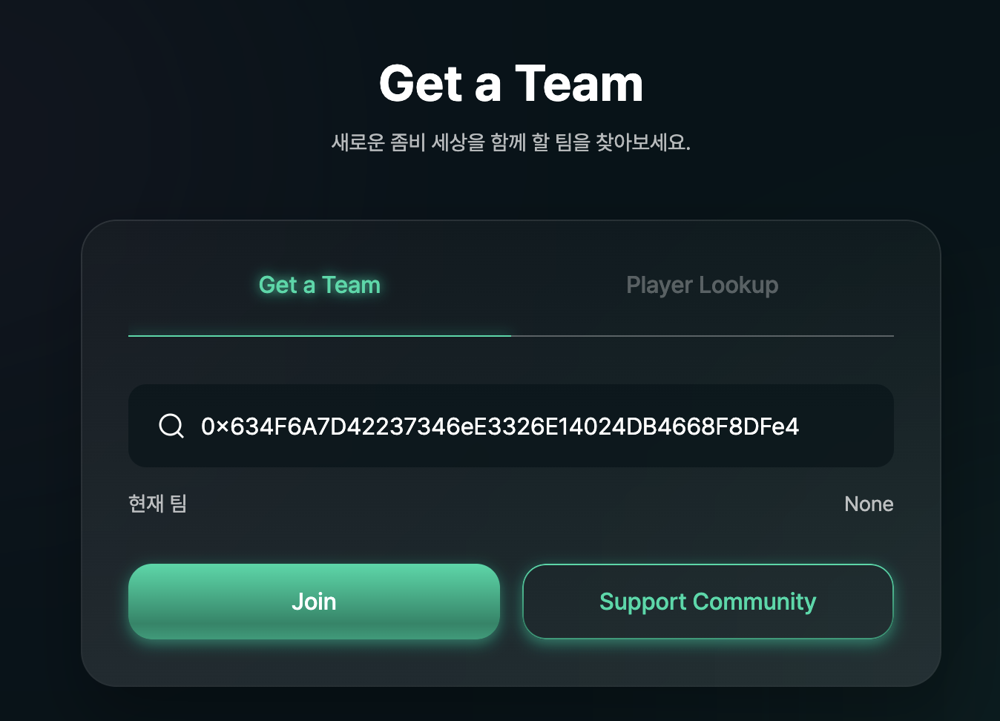
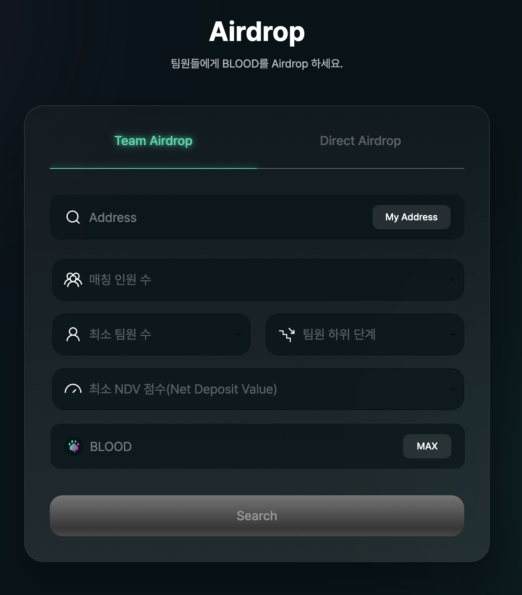

# Team

### Zombie Team: 추천인 팀 홍보 리스트&#x20;

좀비 네트워크는 커뮤니티 활성화와 네트워크 강화를 위해 추천인 보상 제도를 운영합니다. 추천인 5명이상의 1차 하위라인을 보유한 경우 팀으로 승격됩니다. 팀으로 승격된 추천인의 팀원이 되는 경우 예치 및 재예치 시 부과된 거래세금 10% 중 2.5%를 되돌려 받을 수 있습니다.

본 페이지 상단에는 이러한 추천인 팀 중 우수 추천인 팀 목록을 표시합니다. 우수 추천인 팀은 다양한 지표를 반영한 활동지수가 높은 최대 50개의 팀을 선정합니다. 신규 투자자들은 우수 추천인 목록을 참고하여 자신의 추천인을 등록하고 해당 팀원이 될 수 있습니다.

우수 추천인에 선정되어 팀 홍보 리스트에 본인의 지갑 주소와 정책을 홍보하는 것은 그 어떠한 SNS 매체를 통해 홍보하는 것보다 강력한 홍보 마케팅이 될 수 있습니다. 좋은 팀 운영 정책을 통해 더욱 더 많은 팀원들을 구하고 팀원들과 빠르게 Reward 보상을 늘려 나갈 수 있습니다.

자세한 우수 추천인 팀 선정 방식은 추후 공개될 예정입니다.

### **Get a Team:** 추천인 등록 기능

좀비 네트워크에 BLOOD 토큰을 예치하기 위해서는 반드시 추천인 등록이 필요합니다. 추천인 등록 시에는 해당 추천인이 좀비 네트워크에 연결하여 사용하고 있는 지갑 주소(최소 1회 예치)를 등록합니다. 추천인 등록은 최초 예치할 때 한 번만 등록하며, 추후 변경할 수 없습니다. 등록한 추천인은 추천인 보상 제도 상에서 첫번째 상위라인이 됩니다.

추천인으로 등록할 지인이 없는 경우 Support Community를 선택하여 추천인으로 등록할 수 있습니다. 해당 지갑에서 수령하게 되는 추천인 보상금은 모두 좀비 네트워크의 투자자 Community를 위해서만 사용되어 집니다. 이 자금을 활용하여 팀 활동(신규 사용자 유치, 재예치 빈도, Bloody NFT 구매 등)이 우수한 팀과 팀원들을 대상으로 정기적 이벤트를 통해 Airdrop 보상을 제공할 예정입니다. 구체적인 이벤트 정책 등에 대해서는 확정되는 대로 추후 공지 하겠습니다.

### Player Lookup: 좀비 네트워크 참여자 조회 기능

좀비 네트워크에서 투자금을 예치하고 있는 참여자의 투자 현황을 조회할 수 있는 기능입니다. 특히 추천인 팀원을 관리할 때 유용하게 활용하실 수 있습니다.

조회하고자 하는 참여자의 지갑주소를 입력하고 Search 버튼을 클릭하면 해당 참여자의 1차 하위라인 수, 전체 하위라인 팀원 수, 현 Deposit 수량, Airdrop을 보내거나 받은 수량, 최근 Airdrop 발송일 등을 조회할 수 있습니다.

### 팀 관리 및 Airdrop 기능

**Team Viewer:** 참여자의 팀 구성 현황을 표시해 줍니다. 자신의 1차 하위라인 뿐만 아니라 총 15단계까지의 단계별 하위라인 구성이 도식적으로 표시됩니다.

**Team Airdrop:** 팀원들에 대해 손쉽게 Airdrop을 전송할 수 있는 기능입니다. Airdrop 발송 기준, 총 발송 금액, 수령 대상 등을 설정한 후 보내기(Send) 버튼을 누르면 해당 조건에 부합하는 팀원들에게 자동으로 Airdrop을 전송할 수 있습니다. Airdrop 발송 현황 및 결과가 화면에 표시됩니다.

**Direct Airdrop:** 좀비 네트워크 개별 참여자에게 Airdrop을 전송할 수 있는 기능입니다. Airdrop을 수령 받을 참여자의 지갑 주소와 Airdrop 보낼 금액을 입력한 후 보내기(SEND) 버튼을 누르시면 됩니다.


**Airdrop:** 좀비 네트워크의 Airdrop은 일반적인 Airdrop과는 다소 차이가 있습니다. Airdrop을 받을 수 있는 대상은 좀비 네트워크 서비스에 참여하여 최소수량(10 BLD) 이상 예치를 한 사용자 입니다. 그리고 Aiirdrop을 하게 되면 Airdrop을 받은 사용자의 지갑으로 전송되는 것이 아니라 해당 계좌의 좀비 네트워크 예치금으로 직접 전송됩니다. 아울러 Airdrop 시에도 BLOOD 토큰 Tax System이 적용되어 10%를 차감하고 90%만이 전송됩니다.


### Team 등록 방법&#x20;

1. &#x20;Team 등록은 저희 홈페이지 내에서 가능하며 Team 페이지로 가시면 확인하실 수 있습니다. 좀비 네트워크의 Staking 페이지에서 BLOOD 토큰을 예치하기 위해서는 반드시 사전에 팀 등록이 필요합니다.

2\. Get a Team 에서 address에 등록할 지갑주소를 입력하고 Join 버튼을 눌러 팀을 추가합니다. 팀을 등록한 이후에는 Staking 메뉴에서 예치가 가능합니다.

3\. 올바른 지갑 주소를 입력하면 Join 버튼이 활성화되는 것을 확인하실 수 있습니다.

**\*주의하실 점** \
address칸에 입력한 지갑주소가 좀비네트워크에 아직 예치하지 않아 등록되어 있지 않을 경우 아래와 같은 안내창이 나타납니다. 좀비네트워크에 예치하지 않은 지갑주소의 팀 등록은 가능하지만 팀장이 예치하기 전에는 팀원의 예치가 불가능합니다. 또한 한번 등록한 팀장은 변경이 불가능하니 아래 주의사항을 반드시 확인해주세요.

4\. 다른 사용자의 지갑 주소가 아닌 프로토콜 지갑을 Team으로 등록하고 싶다면 아래 표시된 Support Community 버튼을 클릭한 뒤 트랙잭션을 완료하면 프로토콜 지갑이 팀으로 등록됩니다.&#x20;

5\. 팀 등록이 완료되면 아래 사진과 같이 현재 팀 칸에 자신이 등록한 지갑 주소가 나타납니다.&#x20;

### 홍보 게시판 이용 방법&#x20;

1. &#x20;Team 메뉴 상단에 홍보 게시판이 존재합니다. 좀비 네트워크에서 홍보게시판 이용권한을 얻은 좀비는 게시판을 이용해 자신의 팀을 홍보할 수 있습니다.

좀비네트워크 이용자들은 홍보게시판에 올라온 팀장들의 정책을 보고 판단하여 자신에게 최선의 혜택을 주는 팀장을 전략적으로 잘 선택할 수 있습니다. 자세한 내용을 확인하기 위해 View More 버튼을 클릭합니다. 아래 사진에 표시된 복사하기 버튼을 이용하여 팀의 지갑주소를 복사해 원하는 팀을 등록할 수 있습니다.

2\. 홍보 게시판을 이용할 수 있는 이용자에게는 게시판을 작성할 수 있는 Edit 버튼이 함께 표시됩니다. 홍보게시판을 작성한 후에도 Edit 버튼을 이용하여 게시판의 내용을 수정할 수 있습니다.

3\. Edit 버튼을 누르면 홍보 게시판을 작성할 수 있는 창이 나타납니다.

* Team Name : 상단에 표시되는 팀명을 작성하는 칸입니다.
* Content : 홍보 내용을 작성하는 칸입니다.

4\. 아래 사진과 같이 홍보게시판에 등록하고 싶은 내용을 작성합니다. 글을 모두 작성한 뒤 Save 버튼을 눌러 트랜잭션을 완료합니다.

5\. 트랜잭션이 완료되면 아래 사진과 같이 작성한 내용이 홍보게시판에 등록된 것을 확인하실 수 있습니다.

### Viewer 이용 방법

1. Viewer 영역을 통해 자신의 하위 팀원들에 대한 정보를 얻을 수 있습니다.
   * Team viewer : 자신에게 연결되어있는 최대 15 하위라인까지의 주소들을 그래프 형태로 확인할 수 있습니다.
   * My Team viewer : 팀원들의 활동 정보들을 확인할 수 있습니다.

2\. 자신의 주소 또는 확인하고자 하는 지갑의 주소를 입력한 후 ‘Search’ 버튼을 클릭합니다. 팝업창이 생기고, 자신의 하위라인으로 연결되어있는 주소들이 점으로 연결되어 그래프 형태로 표시됩니다. 해당 데이터는 데이터 안정성을 위해 10분에 한번씩 주기적으로 업데이트 되며, 10분안에 발생한 업데이트에 대해서는 잠시동안 차이가 존재할 수 있습니다.

3\. 자동으로 자신의 지갑주소가 입력되어 있으며 자신의 팀원들에 대한 정보를 조회하실 수 있습니다.

4\. 조회가 완료되면 아래 사진과 같은 팀원들의 활동 정보를 확인하실 수 있습니다.

* Direct/ Team : 자신의 직계 하위라인 팀원수 / 하위 15단계 까지의 총 팀원 수
* NDV score : 순예치금액 점수를 확인 할 수 있습니다.
*   Airdrop sent/ received : 에어드랍한 총 BLD양과 에어드랍 받은 총 BLD양을 나타냅니다.\

    **\***팀원의 예치, 재예치시 되돌려 받는 2.5%의 해당하는 금액이 에어드랍의 형태로 지급되기 때문에 Airdrop Sent와 Received에 각각 2.5%에 해당되는 BLD가 추가됩니다.

### Airdrop 이용 방법&#x20;

1. 자신의 팀원들에게 손쉽게 Airdrop을 해줄 수 있는 서비스 입니다.

* 매칭 인원수 : 조회된 총 팀원 수 중 랜덤으로 선택하고자 하는 인원수를 의미합니다. (예를들어 1명만 선택했다면, 전체 10명이 조건에 맞아 조회대상이더라도 랜덤으로 1명만 선택되어 리스트에 나타납니다.)
* 최소 팀원 수 : 선별 조건에 해당하며 본인의 아래 최소 N명의 팀원이 있어야 한다는 조건을 의미합니다. (예를들어 최소 팀원수가 1명이상이면, 본인을 팀장으로 연결한 사람이 1명 이상 있는사람들만 조회됩니다.)
* 팀원 하위 단계 : 조회하고자 하는 자신의 하위 라인 범위를 의미합니다. (예를들어 팀원 하위단계가 10라인이라면 자신으로 연결되어있는 하위 10단계 모든사람들을 탐색 범위로 지정합니다)
* 최소 NDV점수 : NDV 점수 기준치를 조건으로 추가합니다. (예를들어 NDV 점수가 25 BLD 이상이라면, 자신의 NDV 점수가 25이상인 사람들만 최종 결과로 조회됩니다.)
* Blood 입력창 : 총 에어드롭하고자하는 BLOOD 물량을 의미합니다.

2\. 올바른 조건들을 입력한 후 Search 합니다.

3\. 조회가 완료되면 조건에 해당 하는 사람들이 결과로 나타납니다.

4\. 에어드롭하고자 하는 대상들만 체크표시하여 에어드롭을 진행합니다.

5\. 체크된 사람수에 따라 위에 입력한 전체 에어드롭 BLD 물량에서 1/N 이 된 물량만큼만 각자에게 전송됩니다. \
(예를들어 12 BLD를 3명에게 나눠준다면 각자 4BLD 씩 전송됩니다.)\
**\***에어드롭 역시 10%의 세금이 발생하며 세금을 제외한 물량이 실제로 전송됩니다.

6\. 선택한 지갑의 개수마다 트랜잭션 확인창이 발생하며 각각의 모든 트랜잭션 확인 끝나면 Status창이 ‘Completed’ 또는 ‘Failed’로 변경됩니다. Failed로 발생할 경우 실제로 BLOOD가 전송되지는 않았는지 잔액을 꼼꼼히 잘 확인하신 후 진행해주시기 바랍니다.

