# The Last Awesome Zombie (LAZ)

## **LAZ 개요**

클레이튼 기반의 프로젝트들이 장기적으로 실패하는 주된 요인 중 하나는 투자자들의 투자 열기가 런칭 후 얼마가지 않아 소멸되기 때문입니다.

LAZ는 이러한 문제를 해결하기 위해 새로운 패러다임을 제공합니다. 다른 프로젝트와 달리 LAZ는 혁신적인 잭팟 메커니즘을 갖고 있습니다. 시간이 지나면 지날수록 잭팟의 규모는 커지게 됩니다.

런칭 초기 대규모 자금이 유입된 후 대량 매도세가 나오는 것이 일반적인 경우이지만 LAZ는 지속적으로 잭팟 시스템이 가동 되어 자금 대량 유출에 대한 방어가 가능한 우수한 시스템을 갖고 있습니다.

보다 구체적인 LAZ의 특장점은 아래와 같습니다.\

**1. 최소한의 LAZ 참여 비용으로 최고의 기대 수익 효과**\
****\
****매우 적은 금액으로 LAZ 잭팟 게임에 참여하지만 당첨시 엄청난 규모의 상금을 받게 되며 이를 예치함으로써 추가적인 이자 수익을 매일 얻을 수 있게 됨

**2. 신규유저의 지속적인 유입 효과**\
****\
****여타 다른 프로젝트들은 런칭 초기 신규 유저가 유입되고 유입 증가세가 금방 둔화되는 경우가 상당수입니다. 하지만 LAZ의 경우 반복되는 잭팟 게임으로 인해 신규유저가 지속적으로 유입되어 LAZ 서비스의 확장 및 좀비 네트워크의 생태계 확장에도 기여를 하게 됩니다.

**3. 안정적인 텍스풀 운영**\
****\
****LAZ의 참여금과 상금 중 일부는 좀비 네트워크의 텍스풀로 지속적으로 축적이 됩니다. 신규 유저와 기존 유저의 지속적인 LAZ 참여로 인해 텍스풀은 점차 증대되며 이에 따라 텍스풀에서 유저에게 지급 되는 이자 보상금 또한 보다 안정적으로 운영될 수 있습니다.

**4. 안티봇을 통한 부정 거래 방지**\
****\
****개발팀은 안티봇 시스템을 항시 구동하여 게임 진행시 봇이 참여하여 부정거래를 통한 상금을 수령하는 경우 상금이 몰수되는 시스템을 운영하여 모든 게임 참여자들의 공정한 참여가 가능하게 합니다.

## **LAZ 참여방식**

LAZ 게임에서 제한 시간(런칭 초기 : 1시간) 동안 참가자가 없을 경우, 마지막으로 게임을 참가한 참가자가 우승하는 규칙입니다. \
\*제한시간은 상황에 따라 변경될 수 있습니다.

LAZ 게임에 참가할 수 있는 방법은 3가지가 있습니다.

* LAZ Deposit
* LAZ Compound
* LAZ Direct Participate

**1. LAZ Deposit**

&#x20;참여하기 위한 최소 자금은 10 BLD 이상입니다. 참여한 금액의 1BLD 가 지출되며 이 중 80%인 0.8 BLD 가 잭팟풀로 투입되며 0.2 BLD 중 절반인 0.1 BLD는 세금풀로, 나머지 0.1 BLD는  개발 및 마케팅 자금으로 할당됩니다. 남은 9 BLD 는 좀비 네트워크 스테이킹에 자동으로 들어가게 되어 투자자는 장기투자로 추가 복리 수익을 얻을 수 있습니다.

**2. LAZ Compound**

참여하기 위한 최소 자금(Available Rewards에 표시된 금액 )은 10 BLD 이상입니다. 전체 참여 금액 중 1 BLD가 지출되며 이 중 80%인 0.8 BLD 가 잭팟풀로 투입되며 남은 0.2 BLD 중  절반인 0.1 BLD는 세금풀로, 나머지 0.1 BLD는  개발 및 마케팅 자금으로 할당됩니다. 남은 9 BLD 는 좀비 네트워크 스테이킹에 자동으로 자금이 들어가게 되어 투자자는 장기투자로 추가 복리 수익을 얻을 수 있습니다.

**3. LAZ Direct Participate**\
****참여 자금은 2BLD 입니다. 이 중 80%인 1.6 BLD 가 잭팟풀로 투입되며 남은 0.4 BLD 중  절반인 0.2 BLD는 세금풀로, 나머지 0.2 BLD는 개발 및 마케팅 자금으로 할당됩니다.

## **빅뱅(Bigbang)**

빅뱅은 잭팟풀에 일정 금액 이상 모이게 되었을 때 발생하게 됩니다.  빅뱅이 일어나기 위한 BLD 수량은 10,000 BLD 입니다. (매 게임마다 해당 값은 변동 될 수 있습니다.)

\*런칭 초기에는 이 중 5000 BLD를 프로젝트팀에서 제공합니다.

빅뱅 발생시, 모금액의 30%는 세금풀로 이동하게 되며, 70%는 다음 게임의 상금으로 이월 되게 됩니다.

빅뱅이 일어나게 되면 토큰 가격 상승에 긍정적인 영향을 줄 수 있기 때문에 상금 당첨자 뿐만 아니라 LAZ 게임에 참여한 모든 투자자들에게 이득이 됩니다.

* **빅뱅 타겟 수량**

1. 10,000 BLD (런칭 초기: 5,000 BLD 는 개발팀에서 제공) -> 수량은 게임 회차마다 변경될 수 있습니다.
2. 빅뱅시 모금액의 30%를 세금풀로 이동 , 70%는 다음 게임의 상금으로 이월

## LAZ 자금 운용 정책

|                               | Deposit (1 BLD) | Compound (1 BLD) | Direct Participate (2 BLD) |
| ----------------------------- | --------------- | ---------------- | -------------------------- |
| 잭팟(Jackpot pool)              | 0.8 BLD         | 0.8 BLD          | 1.6 BLD                    |
| 세금(Tax pool)                  | 0.1 BLD         | 0.1 BLD          | 0.2 BLD                    |
| 
개발 및 마케팅 (Dev pool)
 | 0.1 BLD         | 0.1 BLD          | 0.2 BLD                    |

****

### **우승 상금 정책**

LAZ 는 다른 유사 프로젝트들과는 달리 차별화된 투자자 친화적인 우승 상금 정책을 갖고 있습니다.

반복되는 게임에서의 상금규모는 매번 다릅니다. 최종 상금이 상대적으로 적은 경우 당첨자는 잭팟풀의 절반을 상금으로 가져가게 되며, 최종 상금 규모가 상대적으로 큰 경우 상금으로 가져가게 되는 비율은 조금 낮지만 총 상금규모의 절대 금액이 큽니다.

이에 따라 상금금액이 적은 경우, 상금금액이 큰 경우 보다 상금 금액에서 당첨자가 가져가는 비중이 최대 15% 높습니다. 반면 상금 금액이 상대적으로 큰 경우 당첨자에게 지급된 최종 상금을 제외한 나머지 금액은 다음 게임 상금의 자금으로 이전되기 때문에 모든 참여자들이 지속적으로 일정수준 이상의 상금을 가져갈 수있는 선순환이 발생하게 됩니다.

&#x20;**최종 상금**

1. 빅뱅타겟 대비 30% 미만 : 모인 잭 풀의 50%
2. 빅뱅 타겟 대비 30% 이상 \~ 60% 미만 : 모인 잭팟 풀의 40%
3. 빅뱅 타겟 대비 60% 이상 \~ 100% 미만 : 모인 잭팟 풀의 35%

* 최종 상금의 90% : 우승자 상금
* 최종 상금의 9% : Tax Pool
* 최종 상금의 1% : 개발팀&마케팅 물량

**빅뱅 타겟 금액 10,000 BLD 설정시 예시**

1. 현재까지 모인 잭팟 풀의 규모가 2,500 BLD인 상태에서 잭팟 발생시(우승자 발생시) \
   이 중 50% 인 1,250 BLD가 최종 상금으로 확정되며 \
   이중 90%인 1,125 BLD가 우승자에게 전달됩니다. \
   나머지 10% 중 9%인 112.5 BLD가 Tax Pool로 이동하며, \
   1%인 12.5 BLD가 개발/마케팅 풀로 이동합니다.
2. 현재까지 모인 잭팟 풀의 규모가 5,000 BLD인 상태에서 잭팟 발생시(우승자 발생시) \
   이 중 40% 인 2,000 BLD가 최종 상금으로 확정되며 \
   이중 90%인 1,800 BLD가 우승자에게 전달됩니다. \
   나머지 10% 중 9%인 180 BLD가 Tax Pool로 이동하며, \
   1%인 18 BLD가 개발/마케팅 풀로 이동합니다.
3. 현재까지 모인 잭팟 풀의 규모가 9,000 BLD인 상태에서 잭팟 발생시(우승자 발생시) \
   이 중 35% 인 3,150 BLD가 최종 상금으로 확정되며 \
   이중 90%인 2,835 BLD가 우승자에게 전달됩니다. \
   나머지 10% 중 9%인 283.5 BLD가 Tax Pool로 이동하며, \
   1%인 29.35 BLD가 개발/마케팅 풀로 이동합니다.

## LAZ 이용가이드

1. 사이트 메뉴 상단에 LAZ 메뉴가 존재합니다. 좀비 네트워크에서 LAZ를 이용해 더 많은 수익을 창출할 수 있습니다.

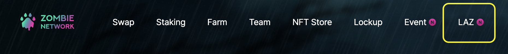

2\. 게임이 시작된 화면은 다음과 같습니다. 게임에 참가한 후 일정 시간 안에 그 다음 참가자가 들어오지 않았을 시 게임에 승리하게 됩니다.

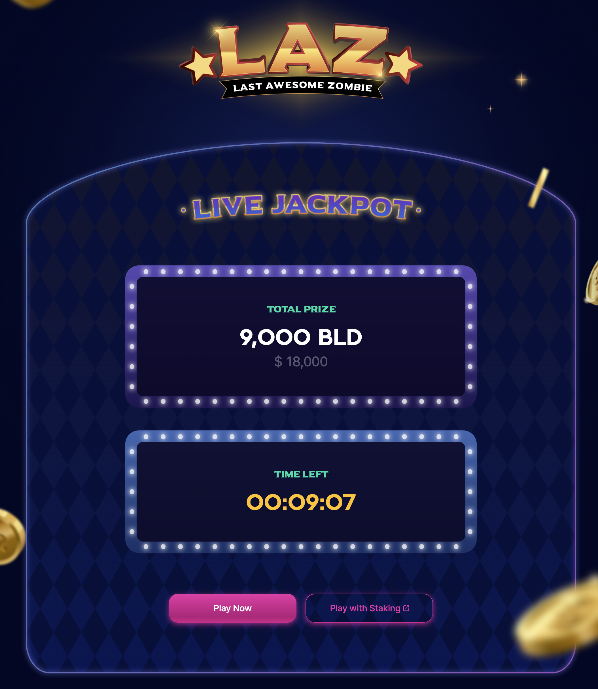

* TOTAL PRIZE: LAZ 우승 상금(이월된 금액 + 참가 금액)
* TIME LEFT: LAZ 게임 참가자가 승리시까지 남은 시간

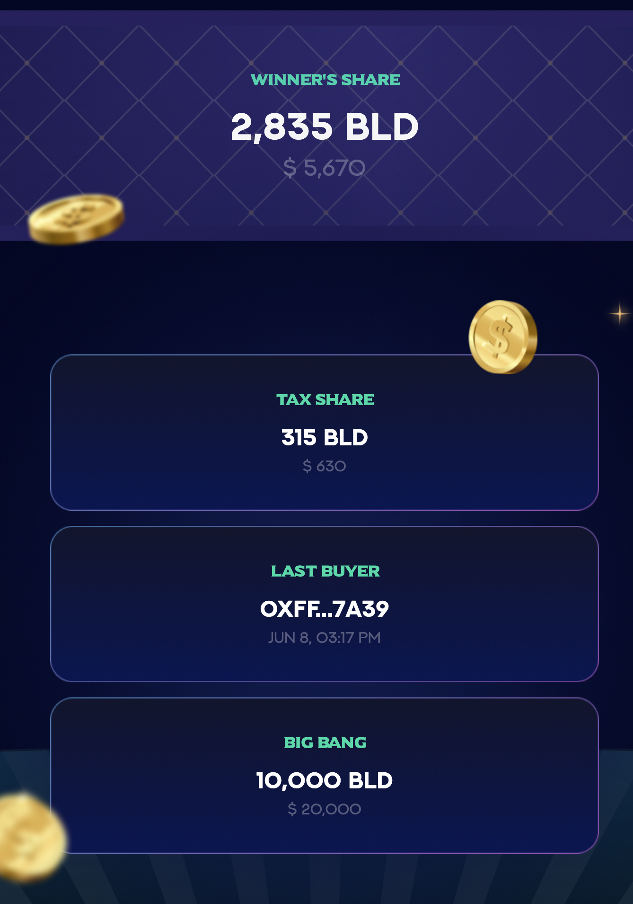

* WINNER’S SHARE: 우승자가 실제로 받게될 상금
* TAX SHARE: 상금풀 중 Tax pool 및 개발/마케팅 자금으로 쓰일 금액
* LAST BUYER: 마지막으로 게임에 참가한 사람의 지갑주소(우승 후보)
* BIG BANG: 빅뱅이 발생 되는 금액(상금풀이 쌓여 빅뱅 수량만큼 쌓이면 빅뱅이 일어나 게임이 종료된다.)

### LAZ 게임 참여 방법

* LAZ 게임에 참가할 수 있는 방법은 3가지가 있습니다.
  * LAZ Deposit
  * LAZ Compound
  * LAZ Direct Participate

#### 1. LAZ Deposit

1-1) “Play with Staking” 버튼 or 헤더의 “Staking” 메뉴를 클릭해서 좀비네트워크의 Staking 페이지로 이동합니다.

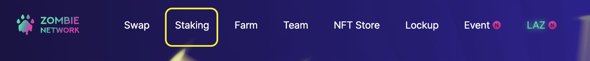

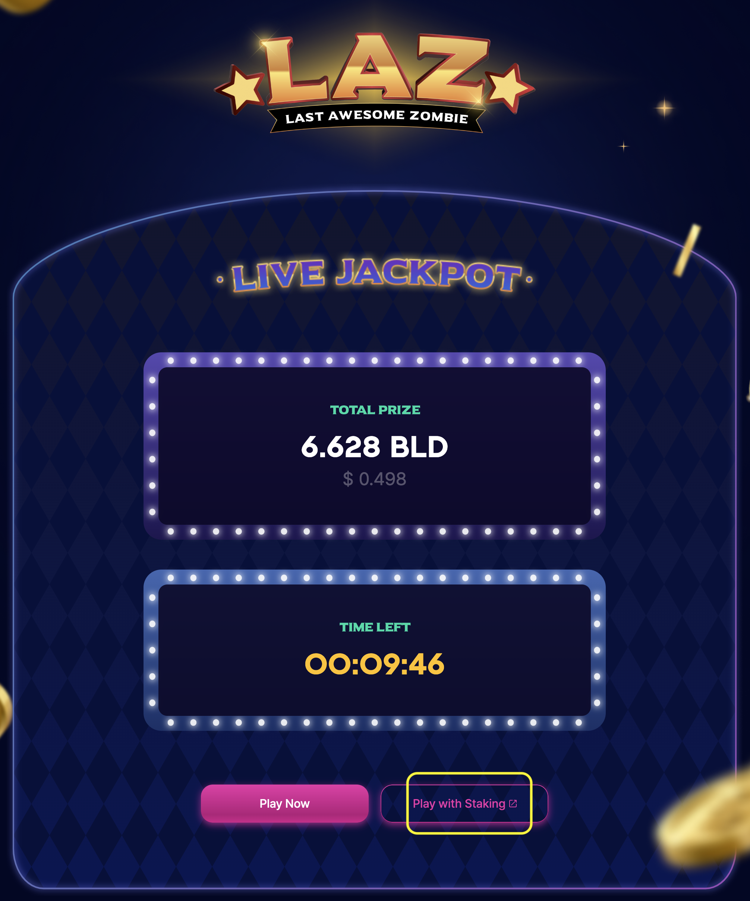

1-2) BLD 토큰 개수를 10개 이상 입력후 “LAZ Deposit” 버튼을 클릭합니다.

주의: LAZ Deposit으로 예치할 경우 BLD 토큰을 최소 10개 이상 BLD 토큰이 필요합니다.

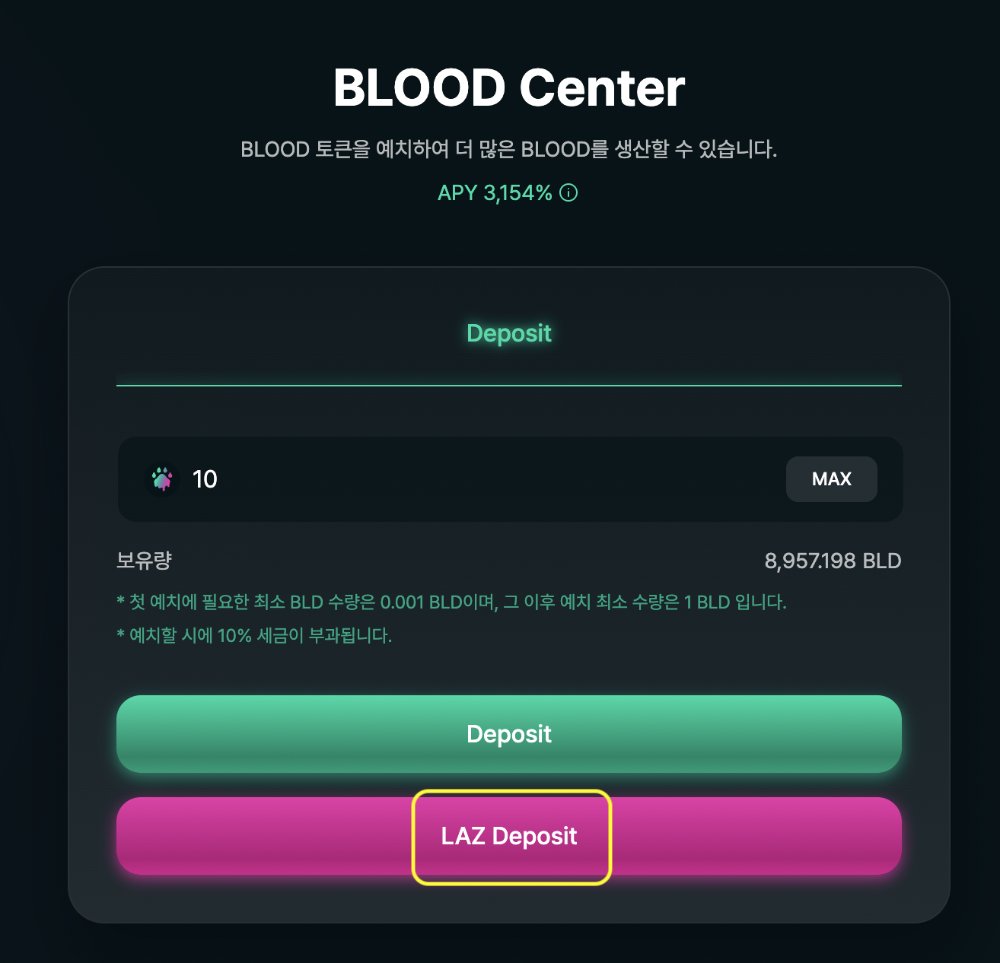

1-3) 다음과 같이 예치를 확인하는 모달 화면이 나타납니다. “LAZ Deposit” 버튼을 클릭하여 예치 및 LAZ 게임에 참가합니다.

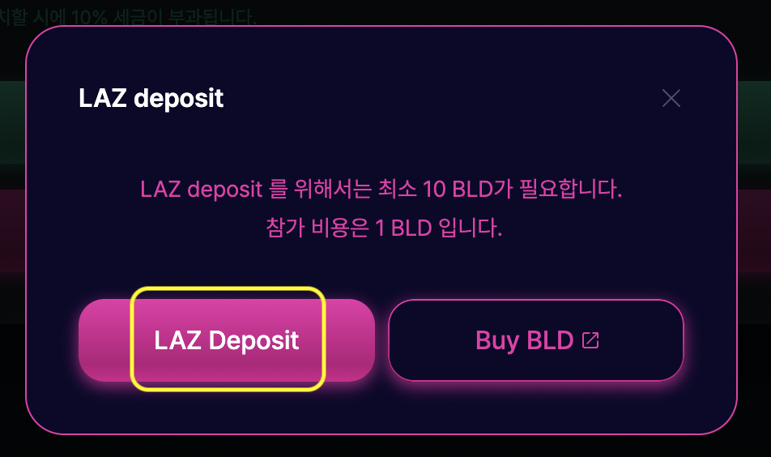

#### 2. LAZ Compound

2-1) Reward Board에 “LAZ Compound” 버튼을 클릭합니다. BLD 보상 토큰이 재예치 되면서 10 BLD는 LAZ 게임 참가 비용으로 사용됩니다.

주의: Available Rewards로 보상 받을 BLD 토큰이 최소 10개 이상 필요합니다.

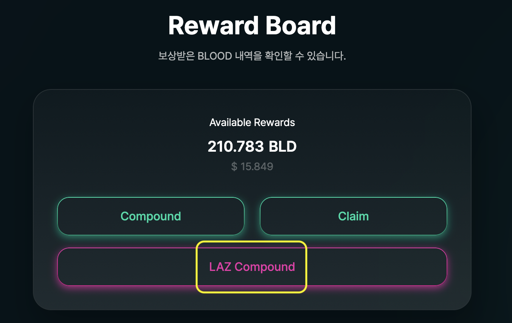

2-2) 다음과 같이 재예치를 확인하는 모달 화면이 나타납니다. “LAZ Compound” 버튼을 클릭하여 재예치 및 LAZ 게임에 참가합니다.

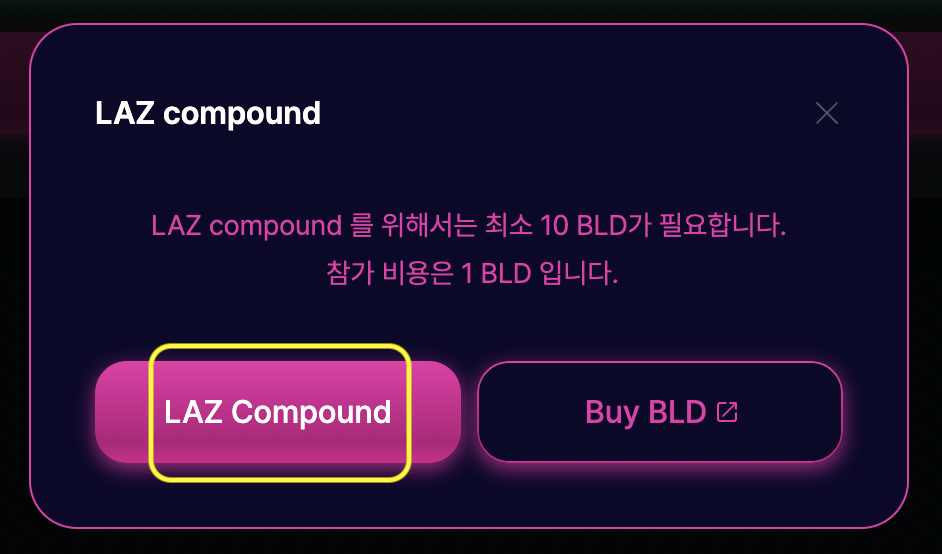

#### 3. LAZ Direct Participate

3-1) LAZ 화면에서 “Play Now” 버튼을 클릭합니다.

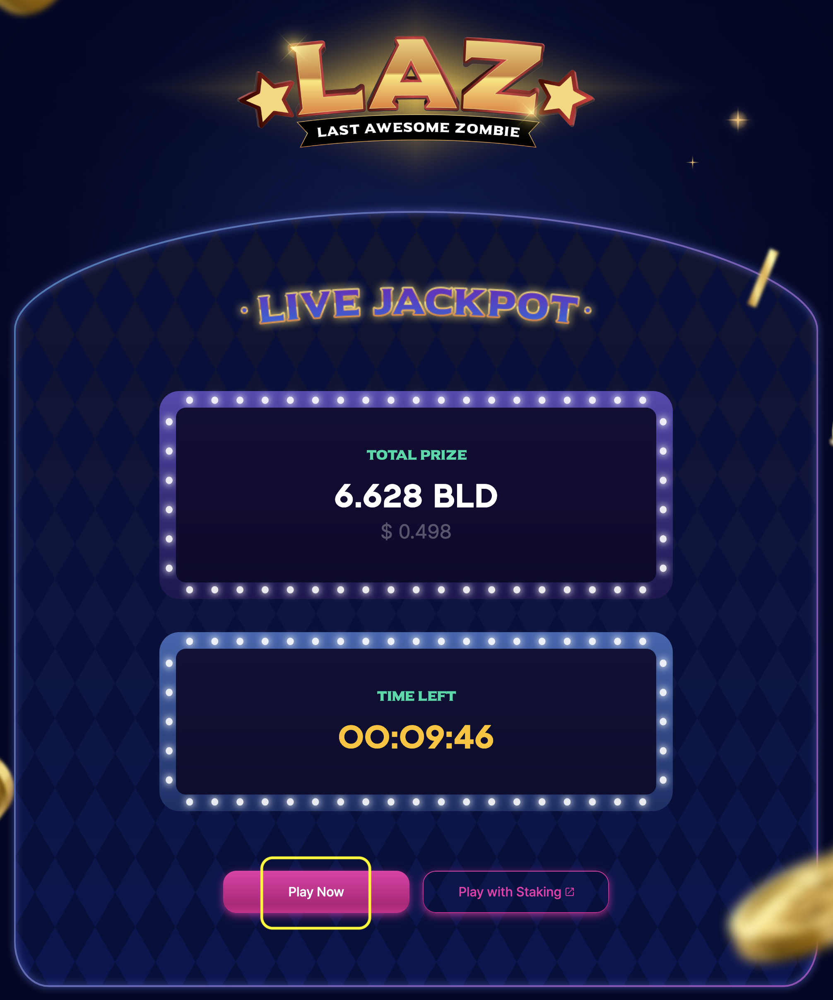

3-2) 다음과 같이 게임 참가를 확인하는 모달 화면이 나타납니다. “Play” 버튼을 클릭하여 LAZ 게임에 참가합니다. 지갑에 2BLD를 소모하여 게임에 참가합니다.

주의: 지갑에 2BLD 이상 소지해야 게임에 참가할 수 있습니다. LAZ를 우승할 시 우승 상금은 Airdrop 방식이며 우승자의 예치금으로 지급됩니다. 따라서 airdrop을 받기 위해 최소 1회 예치를 해야만 합니다.

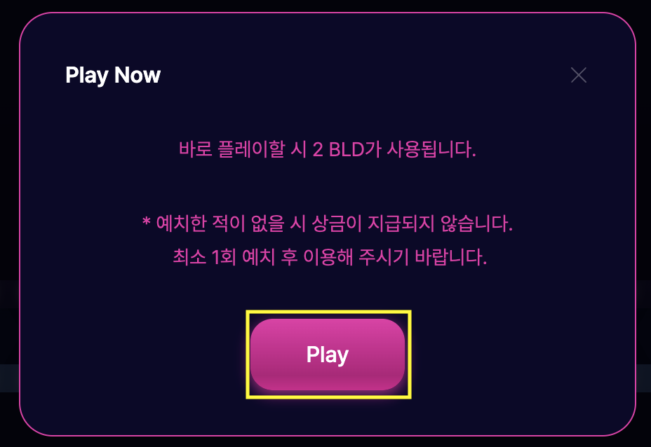

### 빅뱅

* 우승 상금이 빅뱅 목표치에 도달할 시 빅뱅이 발생하여 게임은 종료됩니다.

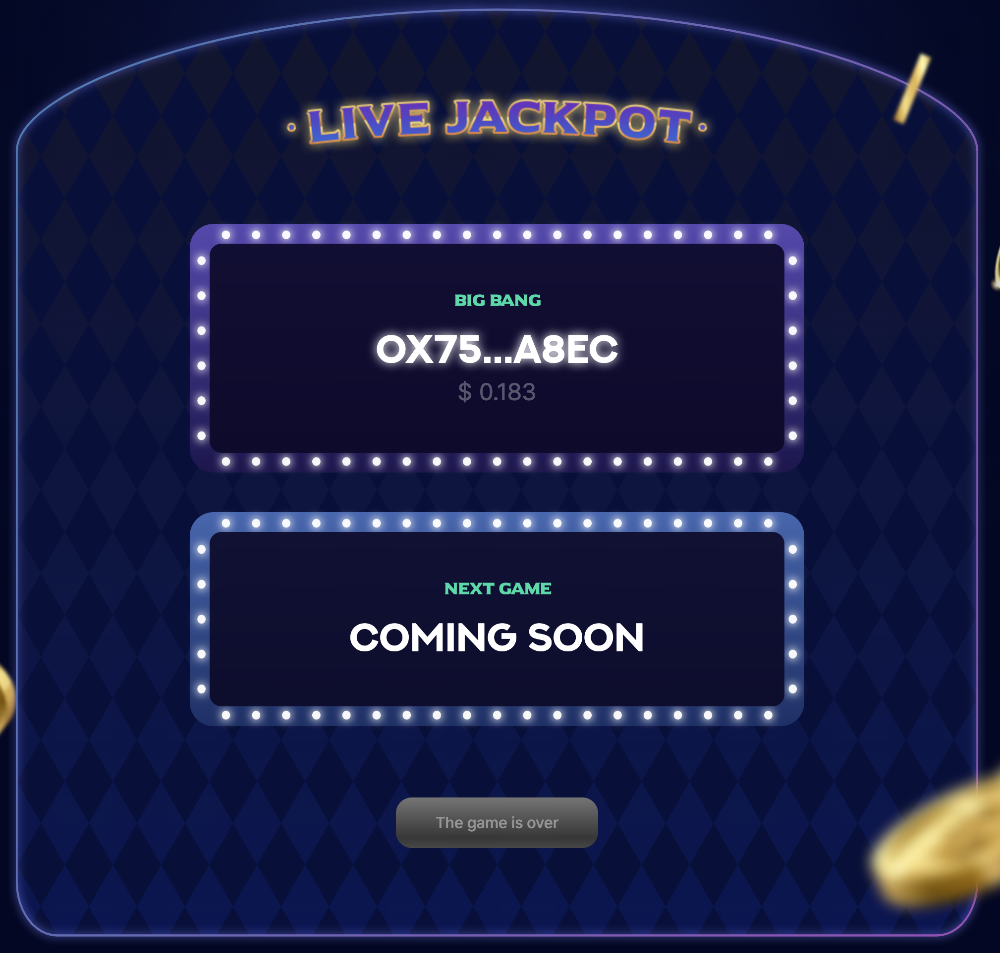
