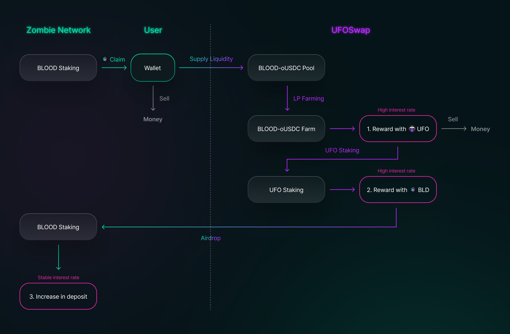
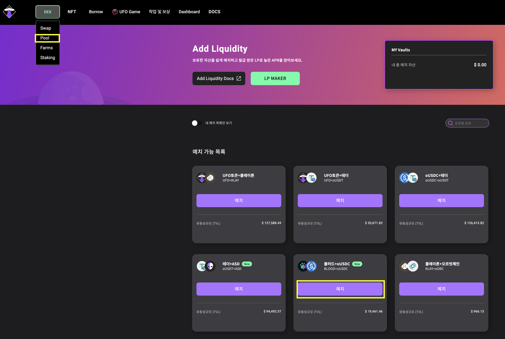
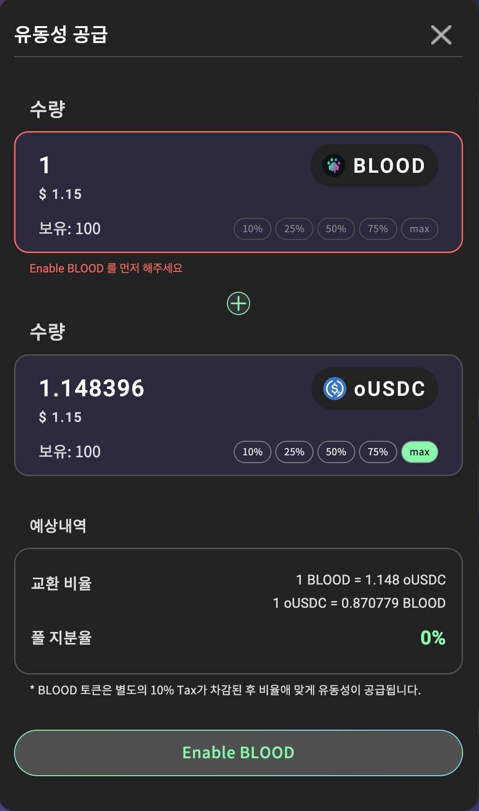
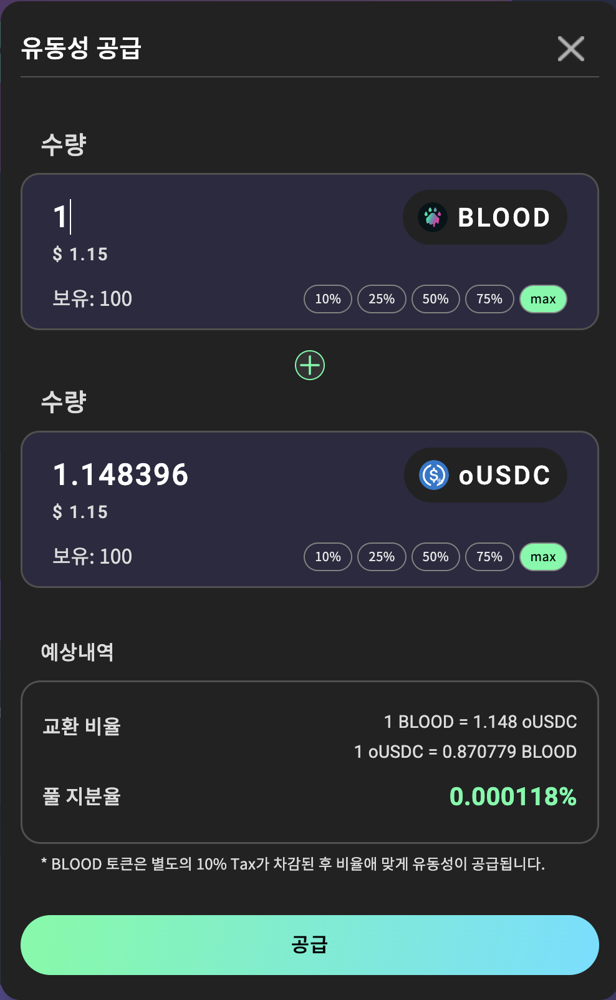
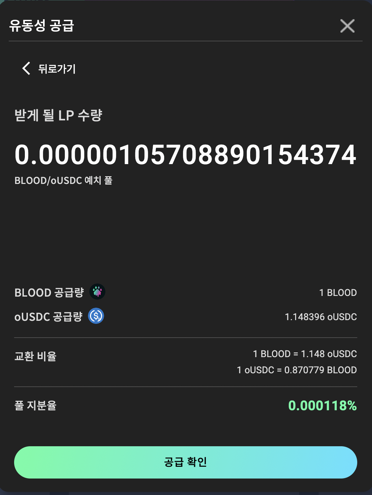
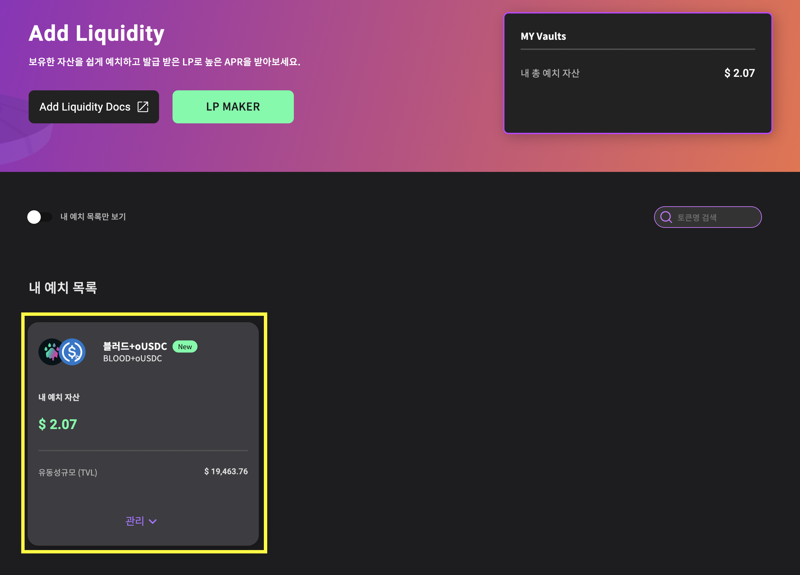
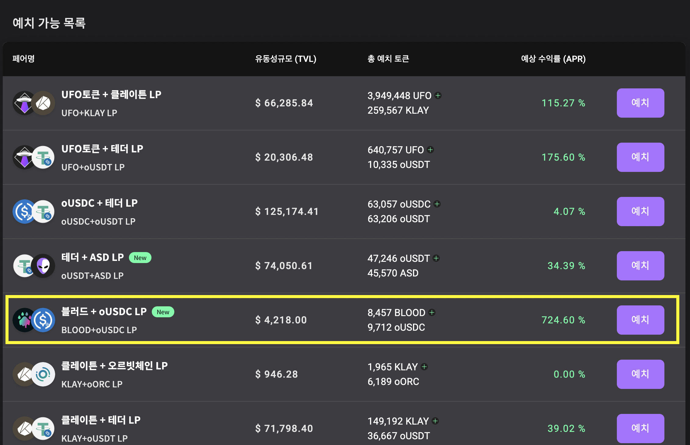
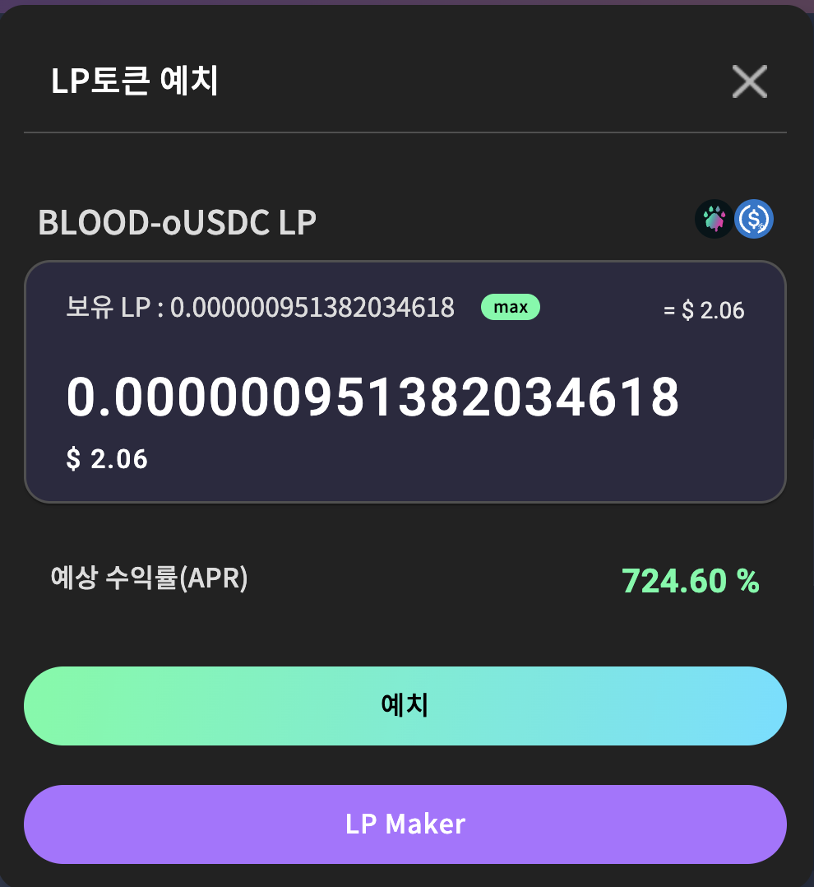
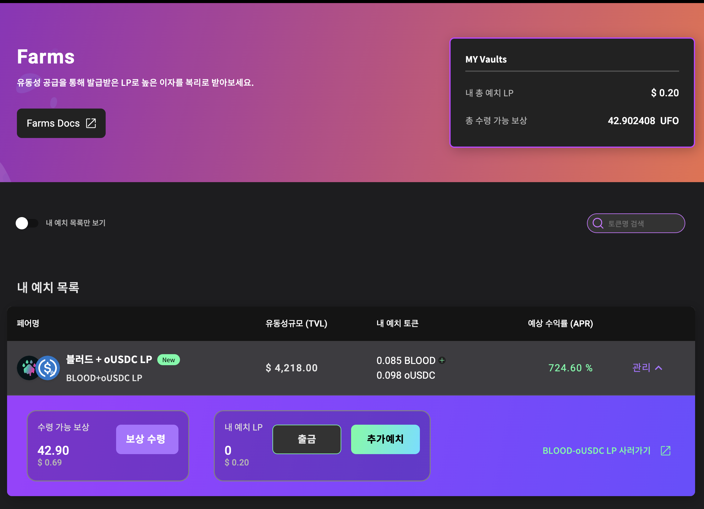
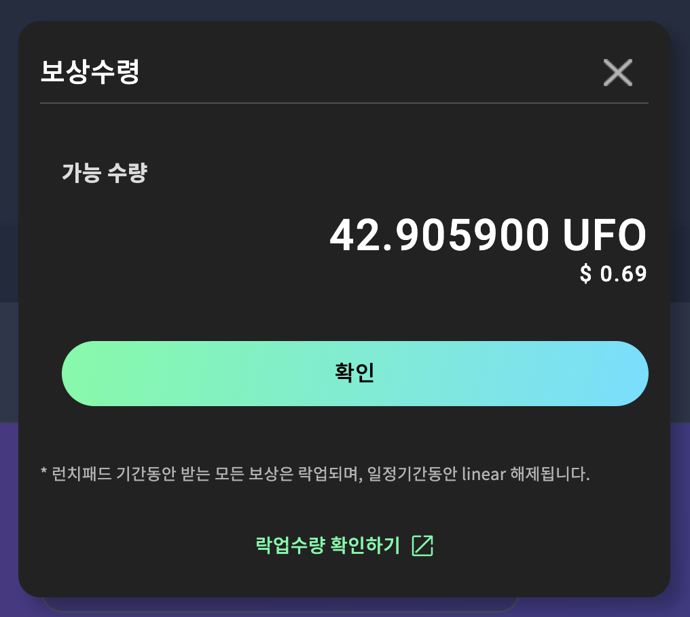

# UFO swap을 활용한 좀비전략

좀비네트워크는 UFO swap과 파트너쉽을 통해 BLOOD와 스테이블 토큰인 USDC 토큰과 새로운 풀을 생성하게 되었습니다.

기존에는 저희 홈페이지에 있는 자체 swap을 통해 BLOOD 토큰을 KLAY로 사거나 판매할수가 있었습니다. 이 이유는 BLOOD 토큰이 KLAY 코인과 페어가 되어있었기 떄문입니다. 저희 자체 덱스에는 BLOOD-KLAY 페어가 존재합니다. 그렇기 때문에 KLAY 가격의 변동성이 BLOOD에 직접적으로 영향을주게 됩니다. 이 때문에 BLOOD 토큰의 매도세가 크지 않았음에도 BLOOD 가격이 많이 하락하거나 영향을 크게 받을 수 있습니다.

하지만 BLOOD와 스테이블이 페어로 묶이게 되면 해당 풀은 더이상 KLAY가격에 영향을 받지 않은 BLOOD가격이 형성됩니다.

이에 따라 좀비네트워크 자체 DEX와 UFO swap DEX의 BLOOD 가격에는 차이가 발생하게 되지만, 가격 차이로 인한 유저들의 차익거래를 통해 BLOOD 가격은 평균값을 찾아나가게 됩니다. 현재는 BLOOD-KLAY 풀에 유동성이 많기 때문에 아직은 KLAY의 영향을 어느정도 받겠지만 시간이 지날수록 많은 BLOOD가 변동성이 적은 UFO swap에서 거래됨에 따라 많은 유동성들이 BLOOD-USDC 풀로 옮겨지게됩니다. 그렇다면 최종적으로는 BLOOD 토큰은 시장 가격에 영향을 받지 않는 안정적인 풀로 유지될 수 있게 됩니다. 이것이 좀비네트워크에서 BLOOD 스테이블 풀을 생성한 이유입니다.

하지만 이런 펀더멘탈적인 장점 이외에도 좀비네트워크 홀더분들이 직접적인 이익을 얻을 수 있는 여러가지 방법이 존재하며 이에 대해 아래에서 자세히 설명드리겠습니다.

위에 그림에서 표시된것과 같이 BLOOD 토큰을 이용하여 추가적인 수익을 얻을 수 있는 방법이 2가지 존재합니다.

1. BLOOD-oUSDC LP 예치(Farming)를 통한 UFO 토큰 보상 수령
2. UFO vault for Zombie에 예치(Staking)를 통한 BLOOD 토큰 Airdrop

첫번째 방법은 UFO swap에 있는 BLOOD-oUSDC풀에 유동성을 공급하고, 유동성 공급을 통해 얻은 BLOOD-oUSDC LP를 Farm에 예치하여 UFO 토큰을 보상으로 수령하는 방법이 있습니다. 현 시점에서 해당 풀은 APR이 750%에 달하는 고이율 풀로서 고수익을 기대해 볼 수 있습니다. 유동성을 공급함으로써 좀비네트워크 생태계측면에서는 더 안정적인 풀 운영으로 BLOOD 토큰의 가격 변동성을 안정적으로 유지 및 상향시키기 때문에 생태계 측면에서도 이로운 방법이며, 이와 동시에 개인적인 측면에서도 고이율의 이자를 받을 수 있기 때문에 서로 윈윈 할 수 있는 방법으로 권장하고 있습니다.

두번째 방법은 위의 과정 또는 swap을 통해 UFO 토큰을 구매하신 후 Staking 페이지에 있는 여러 vault 중 BLOOD을 보상으로 주는 vault에 예치하는 방법입니다. 해당 vault에 예치하게 되면 보상으로 BLOOD를 지급하게 됩니다. 하지만 보상으로 얻는 BLOOD를 지갑으로 지급해주는것이 아니라 Airdrop 방식으로 해당 지갑의 좀비네트워크 예치금으로 들어가기 때문에 많은 UFO 이용자들이 좀비네트워크에 직접 참여해볼 수 있도록 많은 기회를 제공하며, 해당 vault에서 지급하는 BLOOD로 인한 매도세 또한 발생하지 않기 때문에 좀비네트워크 생태계측면에서도 이로운 순환 작용이 발생합니다. 해당 vault 또한 고이율의 BLOOD 이자를 보상으로 지급하기 때문에 하루 1%의 안정적인 BLOOD 토큰 예치 운영방법 뿐만 아니라 고이율 BLOOD 토큰 예치 운영 방안을 새로운 전략으로 가져갈 수 있습니다.

위와 같이 UFO swap팀과의 파트너쉽을 통해 Zombie network의 투자 포트폴리오를 더 다양하게 가져갈 수 있습니다.

### UFO SWAP 이용 가이드

더 자세한 UFO swap 이용 방법을 알기위해서는 UFO swap DOCS를 참고해주시기 바라며, 아래 내용에서는 BLOOD와 관련된 이용 방법에 한해서만 간략히 소개 드리겠습니다.

UFO swap DOCS : [https://ufoswapfi.gitbook.io/korean/how-to/2.swap](https://ufoswapfi.gitbook.io/korean/how-to/2.swap)

1.  **유동성 공급하기**

    \
    a. 사진에서 보이는것과 같이 UFO swap 사이트에 접속하여 상단의 DEX 메뉴를 선택하시고 Pool 페이지로 이동합니다. Pool 페이지로 이동하면 화면 중앙에 BLOOD-oUSDC 풀이 존재하며 ‘예치’버튼을 클릭합니다.

b. 예치버튼을 클릭하면 유동성공급창이 화면에 나타납니다. 처음 이용시 ‘Enable 토큰’을 하라는 안내창이 나올 수 있으며, 아래 ‘Enable 토큰’ 버튼을 클릭하여 활성화 시켜줍니다.

c. Enable 활성화를 하게 되면 안내문구가 사라집니다. 유동성공급하고자 하는 BLOOD 토큰의 수량을 입력하면 자동으로 페어된 USDC 토큰의 수량이 입력되게 됩니다. 내용을 확인한 후 아래 ‘공급’버튼을 클릭합니다.

d. 유동성 공급 내역을 최종적으로 확인하는 화면으로 바뀌며, 내용을 확인 후 ‘공급 확인’ 버튼을 클릭하여 트랜잭션을 요청합니다.

e. 정상적으로 요청이 완료되면 화면 상단에 ‘내 예치 목록’ 란에 방금 진행한 나의 BLOOD-oUSDC 유동성이 공급됨을 확인하실 수 있습니다. 유동성을 공급하게되면 해당 페어의 LP 토큰을 받게 됩니다. 이 LP 토큰을 Staking하여 UFO 토큰을 보상으로 받을 수 있습니다.

f. 화면 상단의 ‘DEX’ 메뉴 버튼 아래에 있는 Farm 버튼을 클릭하여 Farm 페이지로 이동합니다. 리스트 중간쯤 BLOOD-oUSDC LP 항목이 있는것을 확인하실 수 있습니다. ‘예치’버튼을 클릭합니다.

g. ‘예치’버튼을 클릭하면 화면에 ‘LP토큰 예치’ 창이 나타나게 됩니다. 조금 전에 유동성 공급을 통해 얻은 BLOOD-oUSDC LP 의 수량을 입력합니다.(max 버튼을 클릭하여 편리하게 수량을 입력하실 수 있습니다.) 수량을 입력하신 후 ‘예치’ 버튼을 클릭합니다.

h. 예치가 모두 완료되면 Farms 페이지 상단에 ‘내 예치 목록’ 부분에 스테이킹한 나의 BLOOD-oUSDC LP를 확인하실 수 있습니다. 1년동안 예치할 경우 APR 컬럼에 있는 수익률 퍼센트에 해당하는 금액을 UFO 토큰으로 받아 보실 수 있습니다.

i. 쌓인 보상을 수령하기 위해 ‘보상수령’ 버튼을 클릭하시면 아래와 같은 ‘보상수령’ 창이 화면에 나타나게 됩니다. ‘확인’버튼을 클릭하여 트랜잭션을 요청하면 내 지갑으로 해당 수량만큼의 ‘UFO’ 토큰이 들어옵니다.

UFO Swap의 Staking 페이지에 있는 BLOOD vault는 UFO swap에 해당 기능이 출시 된 이후 이용 가이드를 업데이트 해드리도록 하겠습니다.
