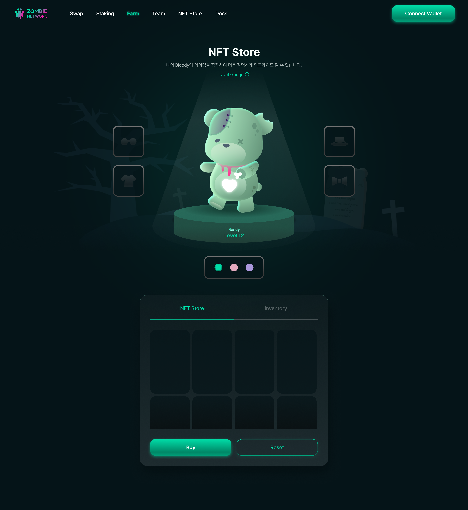

# NFT Store

### NFT Store

Bloody NFT를 구매하는 기능입니다. Bloody NFT의 판매 수량은 한정되어 있으며 종류는 다양합니다. 원하는 Bloody NFT를 골라서 필요한 수량만큼 구매하시면 되며, 종류별로 기능의 차이는 없습니다.\
\
Bloody NFT는 아이템 종류와 상관없이 가지고 있는 총 보유 NFT 수에 따라 Level이 측정됩니다. 여기서 Level이 의미하는 바는 추천인 보상 제도에 있는 하위라인 단계와 같은 숫자를 의미합니다.  [(\[참고\] 추천인 보상 제도) ](../undefined-1/undefined-1.md) 예를 들어 1,597개 이상의 Bloody NFT를 보유하고 있는 지갑의 Bloody는 Level 15로 레벨업하며, 이는 하위라인 15단계까지 모든 Tax 보상을 얻을 수 있음을 의미합니다.

Bloody를 강화하는 Bloody NFT는 다양한 부위별로 생산되며 각 부위별로 다양한 아이템들이 존재합니다. 각 아이템들은 한정 수량만 판매되며 동일 이미지의 Bloody NFT는 추후 재발행 계획이 없습니다.

자세한 Bloody NFT 판매 방식은 추후 공개될 예정입니다.&#x20;

### Inventory

내가 구매한 Bloody NFT를 확인할 수 있으며 부위당 원하는 아이템을 장착하여 나의 Bloody를 강화할 수 있는 기능입니다. 부위당 1개의 아이템만 장착 가능하며 이는 내 Bloody를 꾸미기 위함으로써 기능하고 실제 어떤 아이템을 장착했는지에 따라 기능적으로 차이가 발생하지는 않습니다. 추후 나의 Bloody가 홍보 게시판이나 나의 프로필 기능으로 사용될 예정이며 지속적으로 다양하게 활용도를 높여 나갈 계획입니다.
