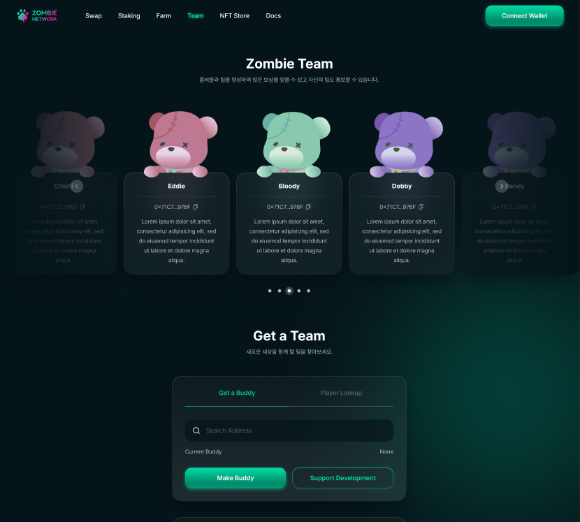

# Team

### Zombie Team: 추천인 팀 홍보 리스트&#x20;

좀비 네트워크는 커뮤니티 활성화와 네트워크 강화를 위해 추천인 보상 제도를 운영합니다. 추천인 5명이상의 1차 하위라인을 보유한 경우 팀으로 승격됩니다. 팀으로 승격된 추천인의 팀원이 되는 경우 예치 및 재예치 시 부과된 거래세금 10% 중 2.5%를 바이백 받을 수 있습니다.

본 페이지 상단에는 이러한 추천인 팀중 우수 추천인 팀 목록을 표시합니다. 우수 추천인 팀은 다양한 지표를 반영한 활동지수가 높은 최대 50개의 팀을 선정합니다. 신규 투자자들은 우수 추천인 목록을 참고하여 자신의 추천인을 등록하고 해당 팀원이 될 수 있습니다.

우수 추천인에 선정되어 팀 홍보 리스트에 본인의 지갑 주소와 정책을 홍보하는 것은 그 어떠한 SNS 매체를 통해 홍보하는 것보다 강력한 홍보 마케팅이 될 수 있습니다. 좋은 팀 운영 정책을 통해 더욱 더 많은 팀원들을 구하고 팀원들과 빠르게 Reward 보상을 늘려나갈 수 있습니다.

자세한 우수 추천인 팀 선정 방식은 추후 공개될 예정입니다.

### Get a Buddy: 추천인 등록 기능

좀비 네트워크에 BLOOD 토큰을 예치하기 위해서는 반드시 추천인 등록이 필요합니다. 추천인 등록 시에는 해당 추천인이 **좀비 네트워크에 연결하여 사용하고 있는 지갑 주소(최소 1회 예치)**를 등록합니다. 추천인 등록은 최초 예치할 때 한 번만 등록하며, 추후 변경할 수 없습니다. 등록한 추천인은 추천인 보상 제도 상에서 첫번째 상위라인이 됩니다.

추천인으로 등록할 지인이 없는 경우 Support Development를 선택하여 추천인으로 등록할 수 있습니다. 해당 지갑에서 수령하게 되는 추천인 보상금은 좀비 네트워크의 마케팅과 개발팀을 지원하는 데 사용 되어집니다.

### Player Lookup: 좀비 네트워크 참여자 조회 기능

좀비 네트워크에서 투자금을 예치하고 있는 참여자의 투자 현황을 조회할 수 있는 기능입니다. 특히 추천인 팀원을 관리할 때 유용하게 활용하실 수 있습니다.

조회하고자 하는 참여자의 지갑주소를 입력하고 Search 버튼을 클릭하면 해당 참여자의 1차 하위라인 수, 전체 하위라인 팀원 수, 현 Deposit 수량, Airdrop을 보내거나 받은 수량, 최근 Airdrop 발송일 등을 조회할 수 있습니다.

### 팀 관리 및 Airdrop 기능

**Team Airdrop**: 팀원들에 대해 손쉽게 Airdrop을 전송할 수 있는 기능입니다. Airdrop 발송 기준, 총 발송 금액, 수령 대상 등을 설정한 후 보내기(Send) 버튼을 누르면 해당 조건에 부합하는 팀원들에게 자동으로 Airdrop을 전송할 수 있습니다. Airdrop 발송 현황 및 결과가 화면에 표시됩니다.

**Team Viewer**: 참여자의 팀 구성 현황을 표시해 줍니다. 자신의 1차 하위라인 뿐만 아니라 총 15단계까지의 단계별 하위라인 구성이 도식적으로 표시됩니다.
